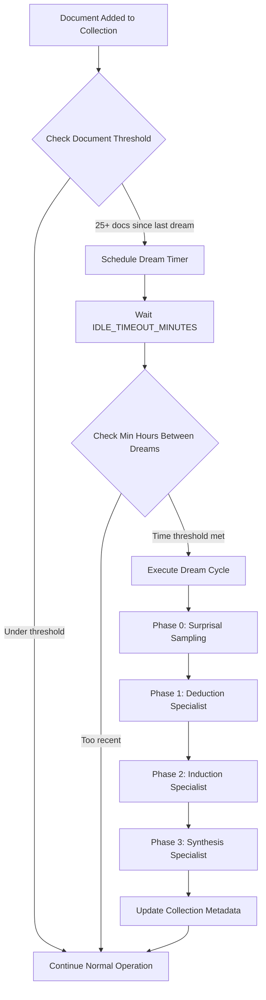
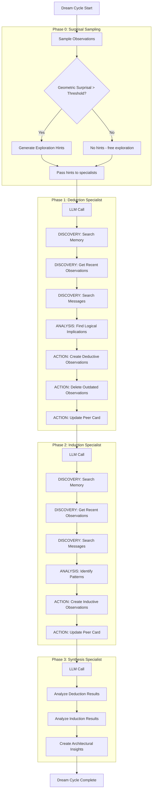
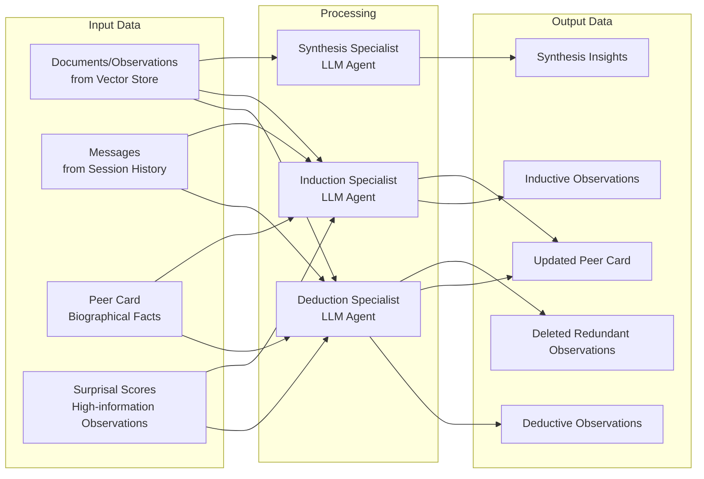
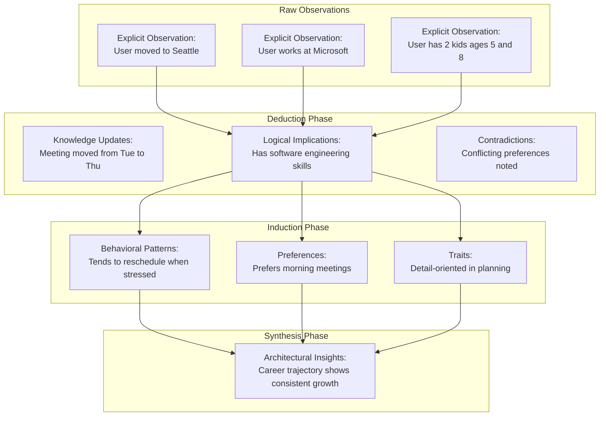
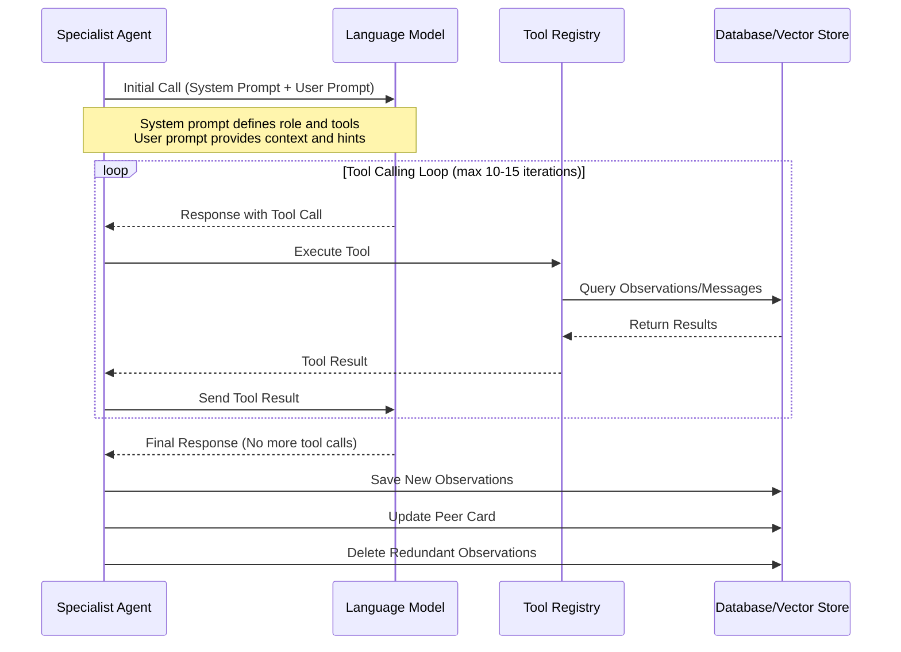
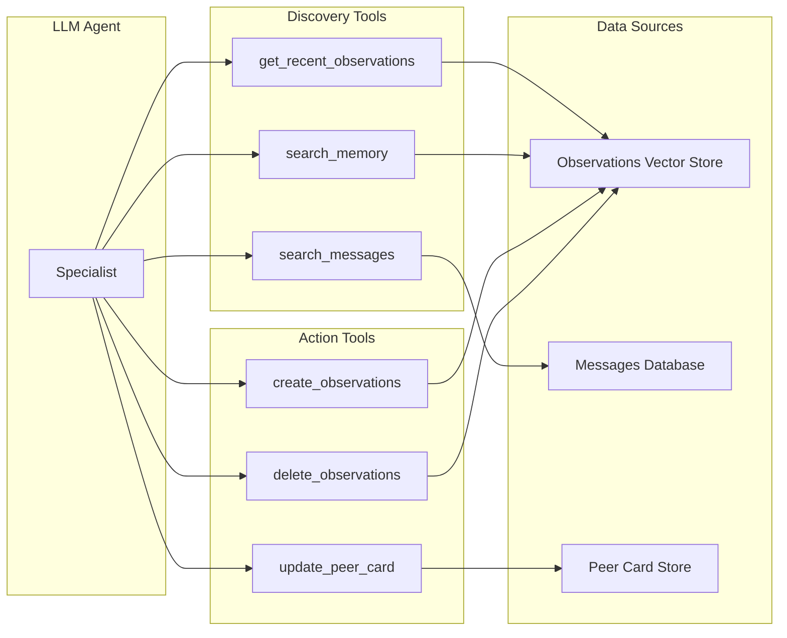
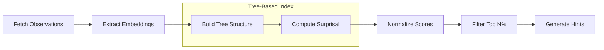
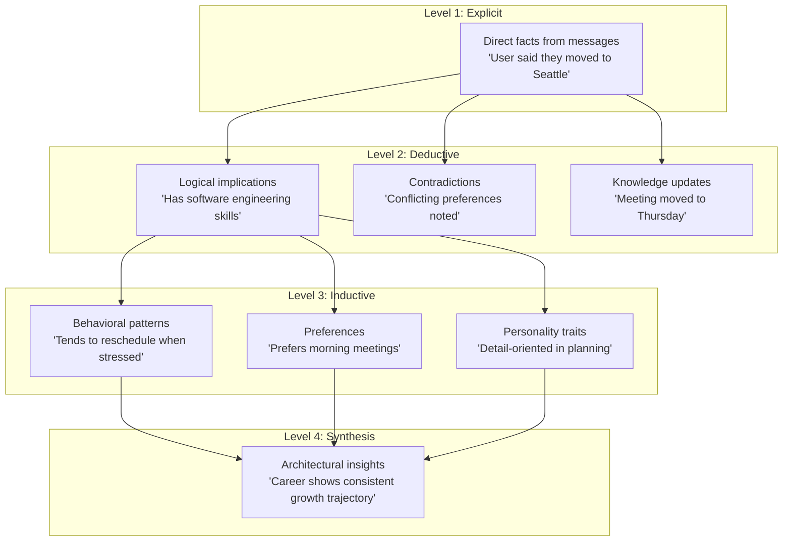
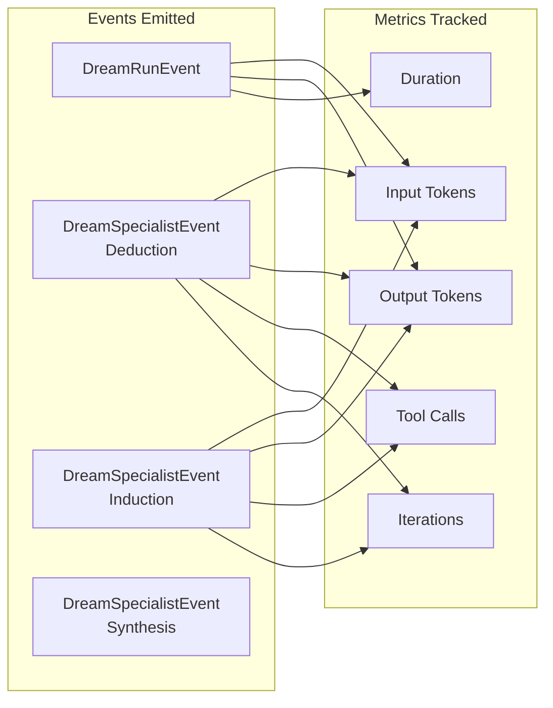

# Honcho Dreaming Process

## Overview

Dreaming is Honcho's memory consolidation and synthesis process. It runs autonomously in the background, analyzing observations about peers to create higher-level insights through deductive and inductive reasoning.

## Dream Cycle Triggers

Dreaming is triggered when a Collection reaches a document threshold (default: 50 new documents since the last dream). The process uses a delayed scheduler to batch work and avoid constant processing.

```
Document Created → Check Threshold (50 docs) 
    → Schedule Timer (30 min delay) 
    → Execute Dream Cycle
```

## Process Flow

### High-Level Dream Cycle



### Detailed Dream Execution Flow



## Object/Data Flows

### Input Data Sources



### Data Transformation Flow



## LLM Involvement

### Where LLMs Are Used

The dreaming process uses LLMs in three autonomous agent contexts:

| Phase | Specialist | LLM Purpose | Model Config |
|-------|-----------|-------------|--------------|
| Phase 1 | **Deduction Specialist** | Analyzes explicit observations to create deductive conclusions, identify contradictions, and update peer cards | `DREAM_DEDUCTION_MODEL` |
| Phase 2 | **Induction Specialist** | Identifies patterns across observations to create inductive generalizations | `DREAM_INDUCTION_MODEL` |
| Phase 3 | **Synthesis Specialist** | Creates high-level architectural insights from deduction and induction results | `DREAM_SYNTHESIS_MODEL` |

### LLM Interaction Pattern



### Tool Arsenal

Each specialist has access to these tools during their exploration:

**Discovery Tools:**
- `get_recent_observations` - Retrieve recent observations from memory
- `search_memory` - Semantic search across observation space
- `search_messages` - Search raw message content

**Action Tools:**
- `create_observations` - Create new deductive/inductive observations
- `delete_observations` - Remove outdated/redundant observations
- `update_peer_card` - Update biographical profile (if enabled)



## Surprisal Sampling

Surprisal sampling is a technique Honcho uses to identify high-information observations during the dreaming process. It pre-filters observations to find the most "surprising" or unexpected ones worth investigating, allowing specialists to focus their attention on the most significant patterns.

### The Concept

In information theory, **surprisal** measures how unexpected an event is relative to what is already known. An observation with high surprisal contains novel information that deviates from the existing pattern.

**High Surprisal = High Information Value**
- Expected: "User attended a meeting" (low surprisal - routine event)
- Unexpected: "User unexpectedly quit their job" (high surprisal - significant deviation)

### Algorithm



**Steps:**
1. **Fetch** observations from the collection (recent/random/all)
2. **Extract** their vector embeddings (1536-dim)
3. **Build** a tree-based spatial index (BallTree or KDTree)
4. **Compute** surprisal score for each observation
5. **Normalize** scores to [0, 1] range using min-max normalization
6. **Select** top N% (default: top 75th percentile)

### Surprisal Computation

The surprisal score is calculated using the tree structure:

```python
# For each observation's embedding
surprisal = tree.surprisal(embedding)

# Based on distance to k-nearest neighbors in the tree
# Higher distance = more isolated = more surprising
```

**Intuition:** An observation that is far from its neighbors in embedding space is "surprising" because it represents information that doesn't fit the existing patterns.

### Configuration

```bash
# Enable/Disable
DREAM_SURPRISAL__ENABLED=true

# Sampling Strategy
DREAM_SURPRISAL__SAMPLING_STRATEGY=recent  # recent | random | all
DREAM_SURPRISAL__SAMPLE_SIZE=200           # Max observations to sample

# Threshold
DREAM_SURPRISAL__TOP_PERCENT_SURPRISAL=0.25  # Take top 25%

# Tree Settings
DREAM_SURPRISAL__TREE_TYPE=balltree  # balltree | kdtree
DREAM_SURPRISAL__TREE_K=5            # k-nearest neighbors
```

### Example Output

```
🎯 Surprisal computation complete. Taking top 25%
Selected: 12/48 observations (top 25%)
📊 Filtered statistics: min=0.750, max=0.987, mean=0.834

Top 5 observations by surprisal:
  #1 [surprisal=0.987] User unexpectedly quit their job
  #2 [surprisal=0.954] User adopted a new dietary restriction
  #3 [surprisal=0.921] User moved to a different time zone
  #4 [surprisal=0.889] User changed their primary work schedule
  #5 [surprisal=0.875] User mentioned a new hobby interest
```

These high-surprisal observations are converted to exploration "hints" sent to the deduction and induction specialists, guiding them toward the most significant patterns.

### Purpose in Dreaming

| Without Surprisal | With Surprisal |
|-------------------|----------------|
| Specialists explore all observations | Specialists focus on high-value observations |
| May miss important patterns in noise | Prioritizes information-dense content |
| Wastes compute on routine events | Efficient use of LLM context window |
| May surface stale/redundant insights | Targets novel, unexpected patterns |

## Input Data Specification

### Surprisal Sampling Input

**Purpose:** Pre-filter observations to find high-information content worth investigating.

**Input Data:**
- All observations in the Collection based on sampling strategy
- Geometric surprisal scores (how unexpected is this observation given context)

**Output:** Up to 10 exploration hints passed to specialists.

### Deduction Specialist Input

**System Prompt Context:**
- Target peer name (`observed`)
- Peer card (biographical facts, if enabled)
- Tool definitions

**User Prompt Context:**
- Optional exploration hints (from surprisal)
- Current peer card state

**During Execution:**
- Recent observations (`get_recent_observations`)
- Search results (`search_memory`, `search_messages`)

### Induction Specialist Input

**System Prompt Context:**
- Target peer name (`observed`)
- Peer card (biographical facts, if enabled)
- Tool definitions

**User Prompt Context:**
- Optional exploration hints (from surprisal)
- Current peer card state

**During Execution:**
- Both explicit AND deductive observations
- Pattern analysis across multiple sources

### Synthesis Specialist Input

**Input Data:**
- Results from deduction phase
- Results from induction phase
- Exploration hints (if any)

**Output:**
- High-level architectural insights about the peer

## Configuration Variables

```bash
# Enable/Disable Dreaming
DREAM_ENABLED=true

# Threshold Settings
DREAM_DOCUMENT_THRESHOLD=25      # Documents added before scheduling
DREAM_IDLE_TIMEOUT_MINUTES=30    # Delay before execution
DREAM_MIN_HOURS_BETWEEN_DREAMS=4  # Minimum time between dreams

# LLM Model Selection
DREAM_PROVIDER=vllm
DREAM_MODEL=qwen3.5:397b-cloud
DREAM_DEDUCTION_MODEL=qwen3.5:397b-cloud
DREAM_INDUCTION_MODEL=qwen3.5:397b-cloud
DREAM_SYNTHESIS_MODEL=qwen3.5:397b-cloud

# LLM Behavior
DREAM_MAX_OUTPUT_TOKENS=8192
DREAM_THINKING_BUDGET_TOKENS=4096
DREAM_MAX_TOOL_ITERATIONS=10

# Surprisal Settings
DREAM_SURPRISAL__ENABLED=true

# History Context
DREAM_HISTORY_TOKEN_LIMIT=16384
```

## Key Concepts

### Observation Levels



### Peer Card

A special document containing stable biographical facts about a peer:
- Name, age, location, occupation
- Family relationships
- Standing instructions (`INSTRUCTION: call me X`)
- Core preferences (`PREFERENCE: prefers detailed explanations`)
- Personality traits (`TRAIT: analytical thinker`)

Updated during deduction and induction phases when new durable facts are discovered.

## Telemetry and Monitoring

Dream cycles emit telemetry events:
- `DreamRunEvent` - Overall dream cycle completion
- `DreamSpecialistEvent` - Individual specialist runs
- Token usage metrics per specialist
- Duration and iteration counts


