# Honcho - Technical Requirements Document

## Version: 3.0.3
## Date: March 2025

---

## Table of Contents

1. [System Overview](#1-system-overview)
2. [Core Concepts](#2-core-concepts)
3. [Data Model & Entity Relationships](#3-data-model--entity-relationships)
4. [API Architecture](#4-api-architecture)
5. [Background Processing Pipeline](#5-background-processing-pipeline)
6. [Agent Systems](#6-agent-systems)
7. [Memory Formation Process](#7-memory-formation-process)
8. [Query & Retrieval System](#8-query--retrieval-system)
9. [Session Management](#9-session-management)
   - [Context Management & Token Limits](#94-context-management--token-limits)
10. [Configuration System](#10-configuration-system)
11. [Security & Authentication](#11-security--authentication)
12. [Telemetry & Monitoring](#12-telemetry--monitoring)

---

## 1. System Overview

Honcho is an open-source memory infrastructure layer for building AI agents with persistent identity and social cognition. It provides APIs for storing conversation history, extracting insights about peers (users and agents), and retrieving contextual information to personalize AI interactions.

### Key Capabilities

- **Peer-Centric Memory**: Store and retrieve observations about any entity (users, agents, groups, ideas)
- **Multi-Participant Sessions**: Support conversations with multiple peers (humans and AI agents)
- **Background Reasoning**: Derive insights from conversations through asynchronous processing
- **Dialectic API**: Natural language query interface for asking questions about peers
- **Dream Processing**: Consolidate and refine observations through scheduled background tasks

### Architecture Components

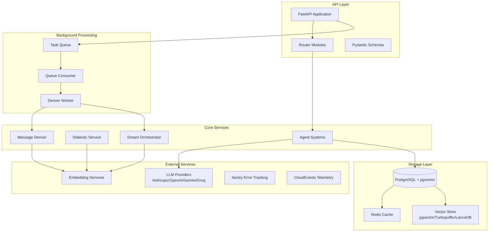
```mermaid
graph TB
    subgraph "API Layer"
        API[FastAPI Application]
        ROUTERS[Router Modules]
        SCHEMAS[Pydantic Schemas]
    end

    subgraph "Core Services"
        AGENTS[Agent Systems]
        DIALECTIC[Dialectic Service]
        DREAMER[Dream Orchestrator]
        DERIVER[Message Deriver]
    end

    subgraph "Background Processing"
        QUEUE[Task Queue]
        CONSUMER[Queue Consumer]
        WORKER[Deriver Worker]
    end

    subgraph "Storage Layer"
        DB[(PostgreSQL + pgvector)]
        CACHE[Redis Cache]
        VECTOR[Vector Store<br/>pgvector/Turbopuffer/LanceDB]
    end

    subgraph "External Services"
        LLM[LLM Providers<br/>Anthropic/OpenAI/Gemini/Groq]
        EMBED[Embedding Services]
        SENTRY[Sentry Error Tracking]
        TELEMETRY[CloudEvents Telemetry]
    end

    API --> ROUTERS
    ROUTERS --> AGENTS
    AGENTS --> LLM
    AGENTS --> DB
    
    API --> QUEUE
    QUEUE --> CONSUMER
    CONSUMER --> WORKER
    WORKER --> DERIVER
    WORKER --> DREAMER
    
    DERIVER --> EMBED
    DREAMER --> EMBED
    DIALECTIC --> EMBED
    
    DB --> CACHE
    DB --> VECTOR

```

---

## 2. Core Concepts

### 2.1 Peer Paradigm

Honcho uses a unified "Peer" model where both users and AI agents are treated equally as participants in the system.

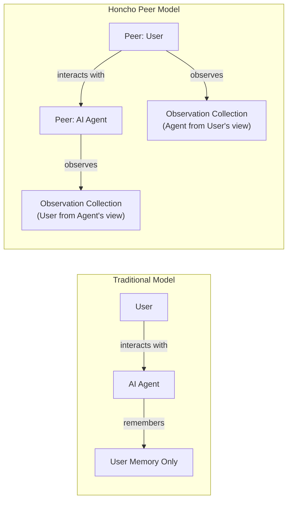
```mermaid
graph LR
    subgraph "Traditional Model"
        USER_TRAD[User] --> |"interacts with"| AGENT_TRAD[AI Agent]
        AGENT_TRAD --> |"remembers"| USER_MEM[User Memory Only]
    end

    subgraph "Honcho Peer Model"
        USER[Peer: User] --> |"interacts with"| AGENT[Peer: AI Agent]
        AGENT --> |"observes"| USER_OBS["Observation Collection<br/>(User from Agent's view)"]
        USER --> |"observes"| AGENT_OBS["Observation Collection<br/>(Agent from User's view)"]
    end
```

### 2.2 Observation Model

Observations are stored at different levels of inference:

| Level | Description | Example |
|-------|-------------|---------|
| **Explicit** | Direct facts from messages | "User said they live in NYC" |
| **Deductive** | Logical inferences from explicit facts | "User has urban lifestyle preferences" |
| **Inductive** | Patterns across multiple observations | "User prefers concise responses" |
| **Contradiction** | Conflicting statements that need resolution | "User said they love/hate coffee" |

### 2.3 Configuration Hierarchy

Configuration is resolved hierarchically from most-specific to most-general:

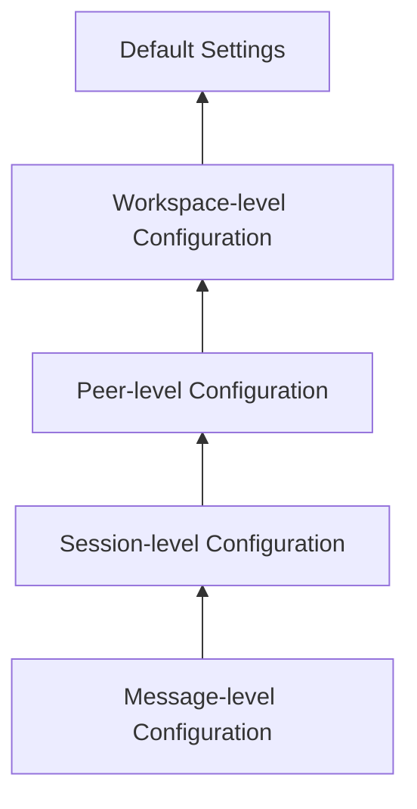
```mermaid
graph BT
    MSG_CONF["Message-level Configuration"]
    SESS_CONF["Session-level Configuration"]
    PEER_CONF["Peer-level Configuration"]
    WKSP_CONF["Workspace-level Configuration"]
    DEFAULT["Default Settings"]

    MSG_CONF --> SESS_CONF
    SESS_CONF --> PEER_CONF
    PEER_CONF --> WKSP_CONF
    WKSP_CONF --> DEFAULT
```

---

## 3. Data Model & Entity Relationships

### 3.1 Entity Relationship Diagram

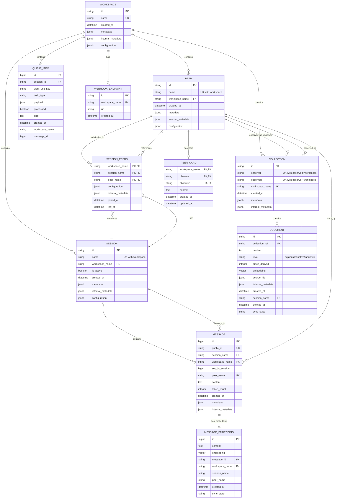
```mermaid
erDiagram
    WORKSPACE {
        string id PK
        string name UK
        datetime created_at
        jsonb metadata
        jsonb internal_metadata
        jsonb configuration
    }

    PEER {
        string id PK
        string name "UK with workspace"
        string workspace_name FK
        datetime created_at
        jsonb metadata
        jsonb internal_metadata
        jsonb configuration
    }

    SESSION {
        string id PK
        string name "UK with workspace"
        string workspace_name FK
        boolean is_active
        datetime created_at
        jsonb metadata
        jsonb internal_metadata
        jsonb configuration
    }

    SESSION_PEERS {
        string workspace_name PK,FK
        string session_name PK,FK
        string peer_name PK,FK
        jsonb configuration
        jsonb internal_metadata
        datetime joined_at
        datetime left_at
    }

    MESSAGE {
        bigint id PK
        string public_id UK
        string session_name FK
        string workspace_name FK
        bigint seq_in_session
        string peer_name FK
        text content
        integer token_count
        datetime created_at
        jsonb metadata
        jsonb internal_metadata
    }

    MESSAGE_EMBEDDING {
        bigint id PK
        text content
        vector embedding
        string message_id FK
        string workspace_name FK
        string session_name
        string peer_name
        datetime created_at
        string sync_state
    }

    COLLECTION {
        string id PK
        string observer "UK with observed+workspace"
        string observed "UK with observer+workspace"
        string workspace_name FK
        datetime created_at
        jsonb metadata
        jsonb internal_metadata
    }

    DOCUMENT {
        string id PK
        string collection_ref FK
        text content
        string level "explicit/deductive/inductive"
        integer times_derived
        vector embedding
        jsonb source_ids
        jsonb internal_metadata
        datetime created_at
        string session_name FK
        datetime deleted_at
        string sync_state
    }

    QUEUE_ITEM {
        bigint id PK
        string session_id FK
        string work_unit_key
        string task_type
        jsonb payload
        boolean processed
        text error
        datetime created_at
        string workspace_name
        bigint message_id
    }

    PEER_CARD {
        string workspace_name PK,FK
        string observer PK,FK
        string observed PK,FK
        text content
        datetime created_at
        datetime updated_at
    }

    WEBHOOK_ENDPOINT {
        string id PK
        string workspace_name FK
        string url
        datetime created_at
    }

    WORKSPACE ||--o{ PEER : contains
    WORKSPACE ||--o{ SESSION : contains
    WORKSPACE ||--o{ COLLECTION : contains
    WORKSPACE ||--o{ QUEUE_ITEM : contains
    WORKSPACE ||--o{ WEBHOOK_ENDPOINT : has

    SESSION ||--o{ SESSION_PEERS : has
    SESSION ||--o{ MESSAGE : contains

    PEER ||--o{ SESSION_PEERS : participates_in

    SESSION_PEERS }o--|| PEER : references
    SESSION_PEERS }o--|| SESSION : references

    PEER ||--o{ COLLECTION : observes_as_observer
    PEER ||--o{ COLLECTION : observed_in

    COLLECTION ||--o{ DOCUMENT : contains

    MESSAGE ||--o| MESSAGE_EMBEDDING : has_embedding
    MESSAGE }o--|| SESSION : belongs_to
    MESSAGE }o--|| PEER : sent_by

    PEER ||--o| PEER_CARD : has_card
```

### 3.2 Key Constraints

- **Workspace-scoped uniqueness**: Peer names, session names are unique within a workspace
- **Composite foreign keys**: Messages link to sessions and peers via composite keys (name + workspace_name)
- **Collection Uniqueness**: Each observer-observed pair in a workspace has exactly one collection
- **Message Embeddings**: Optional vector embeddings for semantic search of messages

---

## 4. API Architecture

### 4.1 API Endpoint Structure

All API routes follow the pattern: `/v3/{resource}/{id}/{action}`

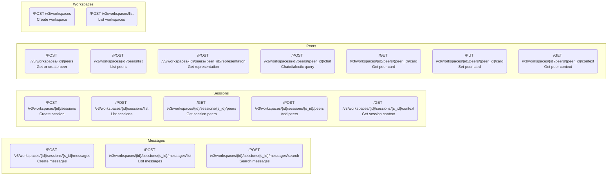
```mermaid
graph TD
    subgraph "Workspaces"
        W_POST("/POST /v3/workspaces<br/>Create workspace")
        W_LIST("/POST /v3/workspaces/list<br/>List workspaces")
    end

    subgraph "Peers"
        P_CREATE("/POST /v3/workspaces/{id}/peers<br/>Get or create peer")
        P_LIST("/POST /v3/workspaces/{id}/peers/list<br/>List peers")
        P_REP("/POST /v3/workspaces/{id}/peers/{peer_id}/representation<br/>Get representation")
        P_CHAT("/POST /v3/workspaces/{id}/peers/{peer_id}/chat<br/>Chat/dialectic query")
        P_CARD_GET("/GET /v3/workspaces/{id}/peers/{peer_id}/card<br/>Get peer card")
        P_CARD_SET("/PUT /v3/workspaces/{id}/peers/{peer_id}/card<br/>Set peer card")
        P_CTX("/GET /v3/workspaces/{id}/peers/{peer_id}/context<br/>Get peer context")
    end

    subgraph "Sessions"
        S_CREATE("/POST /v3/workspaces/{id}/sessions<br/>Create session")
        S_LIST("/POST /v3/workspaces/{id}/sessions/list<br/>List sessions")
        S_PEERS_GET("/GET /v3/workspaces/{id}/sessions/{s_id}/peers<br/>Get session peers")
        S_PEERS_ADD("/POST /v3/workspaces/{id}/sessions/{s_id}/peers<br/>Add peers")
        S_CTX("/GET /v3/workspaces/{id}/sessions/{s_id}/context<br/>Get session context")
    end

    subgraph "Messages"
        M_CREATE("/POST /v3/workspaces/{id}/sessions/{s_id}/messages<br/>Create messages")
        M_LIST("/POST /v3/workspaces/{id}/sessions/{s_id}/messages/list<br/>List messages")
        M_SEARCH("/POST /v3/workspaces/{id}/sessions/{s_id}/messages/search<br/>Search messages")
    end
    
    %% Force vertical arrangement
    W_POST ~~~ P_CREATE
    P_CREATE ~~~ S_CREATE
    S_CREATE ~~~ M_CREATE
```

### 4.2 Request/Response Flow

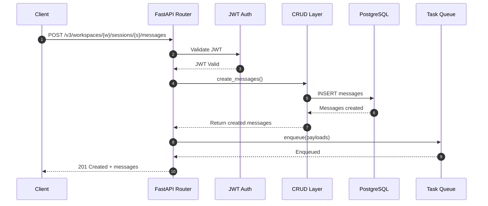
```mermaid
sequenceDiagram
    autonumber
    participant Client
    participant API as FastAPI Router
    participant Auth as JWT Auth
    participant CRUD as CRUD Layer
    participant DB as PostgreSQL
    participant Queue as Task Queue

    Client->>API: POST /v3/workspaces/{w}/sessions/{s}/messages
    API->>Auth: Validate JWT
    Auth-->>API: JWT Valid
    API->>CRUD: create_messages()
    CRUD->>DB: INSERT messages
    DB-->>CRUD: Messages created
    CRUD-->>API: Return created messages
    API->>Queue: enqueue(payloads)
    Queue-->>API: Enqueued
    API-->>Client: 201 Created + messages
```

### 4.3 Authentication Flow

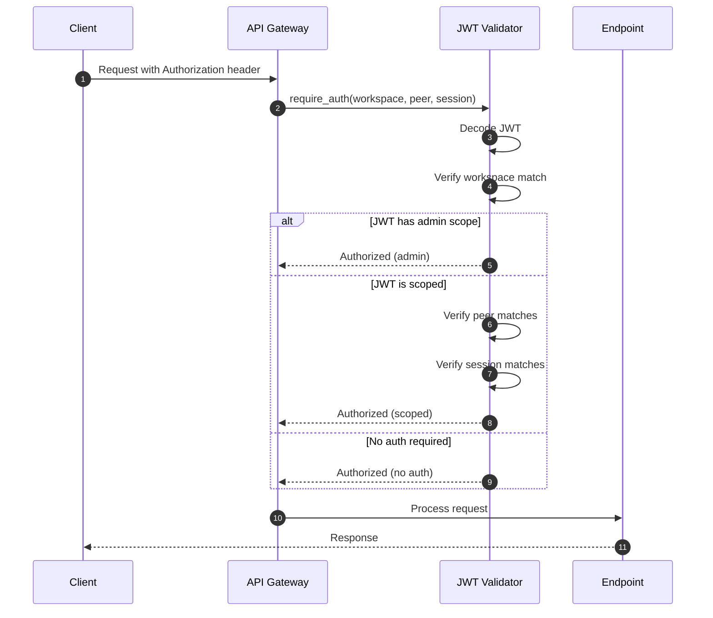
```mermaid
sequenceDiagram
    autonumber
    participant Client
    participant API as API Gateway
    participant Auth as JWT Validator
    participant Endpoint

    Client->>API: Request with Authorization header
    API->>Auth: require_auth(workspace, peer, session)
    Auth->>Auth: Decode JWT
    Auth->>Auth: Verify workspace match
    alt JWT has admin scope
        Auth-->>API: Authorized (admin)
    else JWT is scoped
        Auth->>Auth: Verify peer matches
        Auth->>Auth: Verify session matches
        Auth-->>API: Authorized (scoped)
    else No auth required
        Auth-->>API: Authorized (no auth)
    end
    API->>Endpoint: Process request
    Endpoint-->>Client: Response
```

---

## 5. Background Processing Pipeline

### 5.1 Queue Architecture

The deriver system processes messages asynchronously through a PostgreSQL-backed queue.

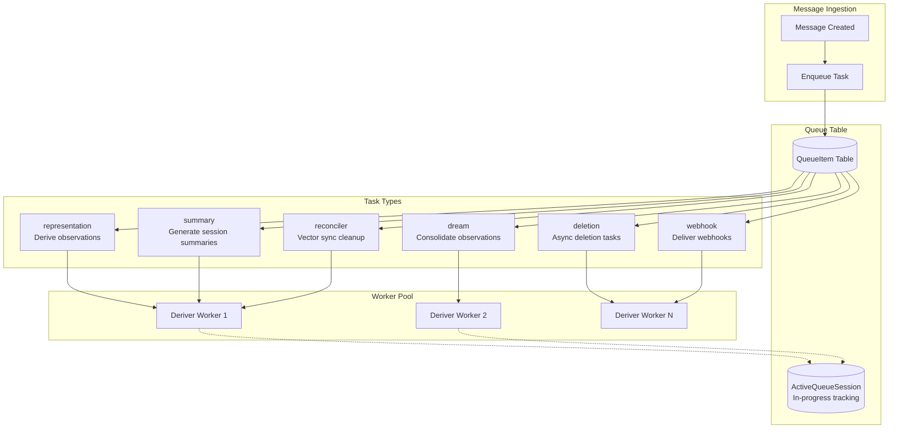
```mermaid
graph TB
    subgraph "Message Ingestion"
        MSG[Message Created]
        ENQUEUE[Enqueue Task]
    end

    subgraph "Queue Table"
        QUEUE[(QueueItem Table)]
        ACTIVE[(ActiveQueueSession<br/>In-progress tracking)]
    end

    subgraph "Task Types"
        REP["representation<br/>Derive observations"]
        SUM["summary<br/>Generate session summaries"]
        DREAM["dream<br/>Consolidate observations"]
        DEL["deletion<br/>Async deletion tasks"]
        WEBHOOK["webhook<br/>Deliver webhooks"]
        RECON["reconciler<br/>Vector sync cleanup"]
    end

    subgraph "Worker Pool"
        WORKER1[Deriver Worker 1]
        WORKER2[Deriver Worker 2]
        WORKERN[Deriver Worker N]
    end

    MSG --> ENQUEUE
    ENQUEUE --> QUEUE
    QUEUE --> REP
    QUEUE --> SUM
    QUEUE --> DREAM
    QUEUE --> DEL
    QUEUE --> WEBHOOK
    QUEUE --> RECON
    
    REP --> WORKER1
    SUM --> WORKER1
    DREAM --> WORKER2
    DEL --> WORKERN
    WEBHOOK --> WORKERN
    RECON --> WORKER1
    
    WORKER1 -.-> ACTIVE
    WORKER2 -.-> ACTIVE
```

### 5.2 Queue Item Processing Flow

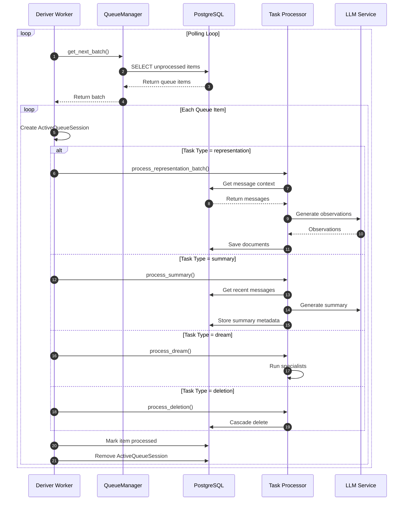
```mermaid
sequenceDiagram
    autonumber
    participant Worker as Deriver Worker
    participant QM as QueueManager
    participant DB as PostgreSQL
    participant Processor as Task Processor
    participant LLM as LLM Service

    loop Polling Loop
        Worker->>QM: get_next_batch()
        QM->>DB: SELECT unprocessed items
        DB-->>QM: Return queue items
        QM-->>Worker: Return batch

        loop Each Queue Item
            Worker->>Worker: Create ActiveQueueSession
            
            alt Task Type = representation
                Worker->>Processor: process_representation_batch()
                Processor->>DB: Get message context
                DB-->>Processor: Return messages
                Processor->>LLM: Generate observations
                LLM-->>Processor: Observations
                Processor->>DB: Save documents
            else Task Type = summary
                Worker->>Processor: process_summary()
                Processor->>DB: Get recent messages
                Processor->>LLM: Generate summary
                Processor->>DB: Store summary metadata
            else Task Type = dream
                Worker->>Processor: process_dream()
                Processor->>Processor: Run specialists
            else Task Type = deletion
                Worker->>Processor: process_deletion()
                Processor->>DB: Cascade delete
            end
            
            Worker->>DB: Mark item processed
            Worker->>DB: Remove ActiveQueueSession
        end
    end
```

### 5.3 Representation Task Flow with LLM Processing

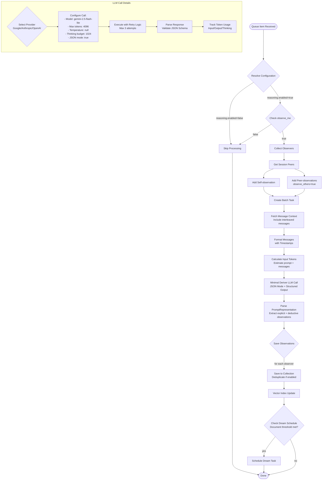
```mermaid
flowchart TD
    START([Queue Item Received]) --> CONFIG{Resolve Configuration}
    CONFIG -->|reasoning.enabled=false| SKIP[Skip Processing]
    CONFIG -->|reasoning.enabled=true| OBSERVE{Check observe_me}
    
    OBSERVE -->|false| SKIP
    OBSERVE -->|true| COLLECT[Collect Observers]
    
    COLLECT --> PEERS[Get Session Peers]
    PEERS --> SELF_OBS[Add Self-observation]
    PEERS --> PEER_OBS[Add Peer-observations
    observe_others=true]
    
    SELF_OBS --> BATCH[Create Batch Task]
    PEER_OBS --> BATCH
    
    BATCH --> FETCH[Fetch Message Context
Include interleaved messages]
    FETCH --> FORMAT[Format Messages
with Timestamps]
    
    FORMAT --> TOKEN_CALC[Calculate Input Tokens
Estimate prompt + messages]
    TOKEN_CALC --> LLM_CALL["Minimal Deriver LLM Call
JSON Mode + Structured Output"]
    
    subgraph "LLM Call Details"
        PROVIDER{Select Provider
Google/Anthropic/OpenAI} --> CONFIG_CALL[Configure Call:
- Model: gemini-2.5-flash-lite
- Max tokens: 4096
- Temperature: null
- Thinking budget: 1024
- JSON mode: true]
        CONFIG_CALL --> RETRY["Execute with Retry Logic
Max 3 attempts"]
        RETRY --> PARSE_RESP["Parse Response
Validate JSON Schema"]
        PARSE_RESP --> TOKEN_TRACK["Track Token Usage
Input/Output/Thinking"]
    end
    
    LLM_CALL --> PARSE[Parse PromptRepresentation
Extract explicit + deductive observations]
    
    PARSE --> SAVE{Save Observations}
    SAVE -->|for each observer| SAVE_COLL[Save to Collection
Deduplicate if enabled]
    SAVE_COLL --> INDEX[Vector Index Update]
    
    INDEX --> CHECK_DREAM{Check Dream Schedule
Document threshold met?}
    CHECK_DREAM -->|yes| SCHED_DREAM[Schedule Dream Task]
    CHECK_DREAM -->|no| DONE
    SCHED_DREAM --> DONE([Done])
    SKIP --> DONE
```

**LLM Configuration for Deriver:**

| Parameter | Value | Purpose |
|-----------|-------|---------|
| Provider | Google (default) | Cost-efficient bulk processing |
| Model | gemini-2.5-flash-lite | Fast inference for observation extraction |
| Max Output Tokens | 4096 | Cap observation generation |
| Thinking Budget | 1024 tokens | Allow reasoning within limits |
| Temperature | null | Deterministic output preferred |
| JSON Mode | true | Structured output validation |
| Retry Attempts | 3 | Handle transient failures |
| Stop Sequences | ["   \n", "\n\n\n\n"] | Prevent hallucinated continuations |

---

## 6. Agent Systems

### 6.1 Agent Architecture Overview

Honcho employs three specialized agent types that work together:

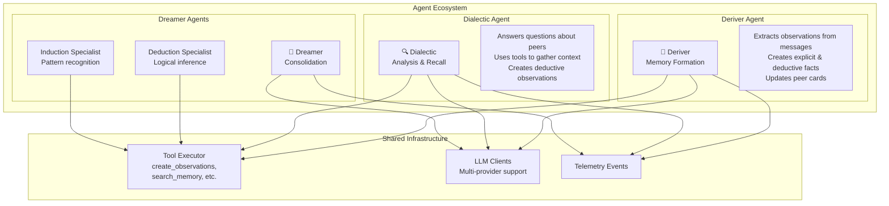
```mermaid
graph TB
    subgraph "Agent Ecosystem"
        direction TB
        
        subgraph "Deriver Agent"
            DERIVER["📝 Deriver<br/>Memory Formation"]
            DERIVER_DESC["Extracts observations from messages<br/>Creates explicit & deductive facts<br/>Updates peer cards"]
        end
        
        subgraph "Dialectic Agent"
            DIALECTIC["🔍 Dialectic<br/>Analysis & Recall"]
            DIALECTIC_DESC["Answers questions about peers<br/>Uses tools to gather context<br/>Creates deductive observations"]
        end
        
        subgraph "Dreamer Agents"
            DREAMER["💭 Dreamer<br/>Consolidation"]
            DEDUCTION["Deduction Specialist<br/>Logical inference"]
            INDUCTION["Induction Specialist<br/>Pattern recognition"]
        end
    end
    
    subgraph "Shared Infrastructure"
        TOOLS["Tool Executor
 create_observations, search_memory, etc."]
        CLIENTS["LLM Clients
Multi-provider support"]
        TELEMETRY["Telemetry Events"]
    end
    
    DERIVER --> TOOLS
    DIALECTIC --> TOOLS
    DEDUCTION --> TOOLS
    INDUCTION --> TOOLS
    
    DERIVER --> CLIENTS
    DIALECTIC --> CLIENTS
    DREAMER --> CLIENTS
    
    DERIVER --> TELEMETRY
    DIALECTIC --> TELEMETRY
    DREAMER --> TELEMETRY
```

### 6.2 Deriver Agent - LLM Memory Formation

The Deriver is a minimal-overhead memory formation agent optimized for high-throughput batch processing.

**Characteristics:**
- Single LLM call per message batch (no tool calls for efficiency)
- JSON mode with structured Pydantic output (PromptRepresentation)
- Creates explicit observations and simple deductive inferences
- Provider: Google Gemini by default (cost-efficient for bulk processing)
- Updates peer cards with biographical facts

**Detailed LLM Flow:**

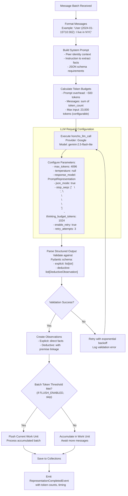
```mermaid
flowchart TD
    A[Message Batch Received] --> B["Format Messages
    Example: 'User (2024-01-15T10:30Z): I live in NYC'"]
    B --> C["Build System Prompt
    - Peer identity context
    - Instruction to extract facts
    - JSON schema requirements"]
    
    C --> TOKEN_CALC["Calculate Token Budgets
    - Prompt overhead: ~500 tokens
    - Messages: sum of token_count
    - Max input: 23,000 tokens (configurable)"]
    
    TOKEN_CALC --> D["Execute honcho_llm_call
    Provider: Google
    Model: gemini-2.5-flash-lite"]
    
    subgraph "LLM Request Configuration"
        D --> CFG["Configure Parameters:
        - max_tokens: 4096
        - temperature: null
        - response_model: PromptRepresentation
        - json_mode: true
        - stop_seqs: ['   \\n', '\\n\\n\\n\\n']
        - thinking_budget_tokens: 1024
        - enable_retry: true
        - retry_attempts: 3"]
    end
    
    CFG --> E["Parse Structured Output
    Validate against Pydantic schema:
    - explicit: list[str]
    - deductive: list[DeductiveObservation]"]
    
    E --> F{Validation Success?}
    F -->|Yes| G["Create Observations
    - Explicit: direct facts
    - Deductive: with premise linkage"]
    F -->|No| RETRY["Retry with exponential backoff
    Log validation error"]
    RETRY --> D
    
    G --> H{"Batch Token Threshold Met?
    (if FLUSH_ENABLED, skip)"}
    H -->|Yes| FLUSH["Flush Current Work Unit
    Process accumulated batch"]
    H -->|No| ACCUM["Accumulate in Work Unit
    Await more messages"]
    FLUSH --> I[Save to Collections]
    ACCUM --> I
    
    I --> TELEM["Emit RepresentationCompletedEvent
    with token counts, timing"]
```

**Deriver LLM Response Format:**

```json
{
  "explicit": [
    "User mentioned living in New York City",
    "User works as a software engineer at Google"
  ],
  "deductive": [
    {
      "conclusion": "User has software engineering skills",
      "premises": ["User works as a software engineer at Google"],
      "confidence": "high"
    }
  ]
}
```

### 6.3 Dialectic Agent - Detailed LLM Process

The Dialectic answers natural language queries about peers using iterative tool-based context gathering with configurable reasoning depth.

**Characteristics:**
- Multi-iteration tool calling (configurable: 1-10 iterations based on reasoning level)
- Prefetches semantically relevant observations using embeddings
- Can create new deductive observations during reasoning
- Supports streaming and non-streaming responses
- Five reasoning levels with different LLM configurations

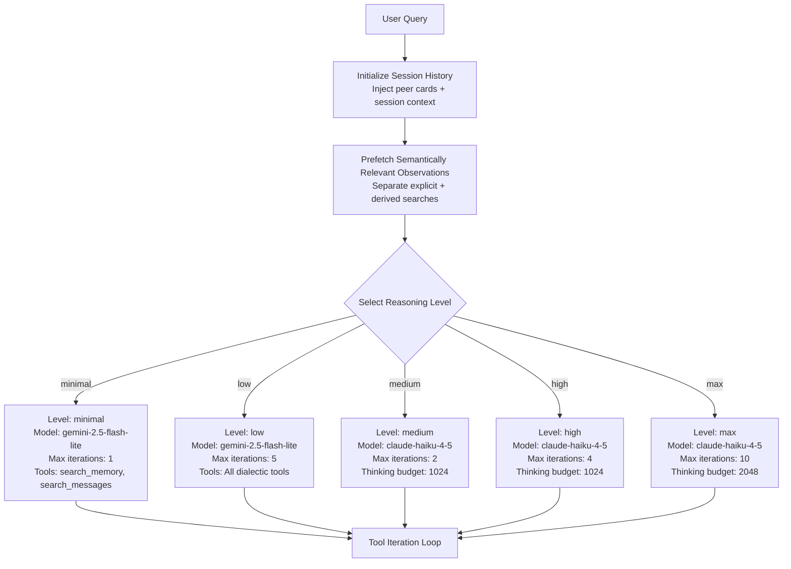
```mermaid
flowchart TD
    A[User Query] --> B[Initialize Session History
    Inject peer cards + session context]
    B --> C[Prefetch Semantically Relevant Observations
    Separate explicit + derived searches]
    C --> D{Select Reasoning Level}
    
    D -->|minimal| MIN["Level: minimal
    Model: gemini-2.5-flash-lite
    Max iterations: 1
    Tools: search_memory, search_messages"]
    
    D -->|low| LOW["Level: low
    Model: gemini-2.5-flash-lite
    Max iterations: 5
    Tools: All dialectic tools"]
    
    D -->|medium| MED["Level: medium
    Model: claude-haiku-4-5
    Max iterations: 2
    Thinking budget: 1024"]
    
    D -->|high| HIGH["Level: high
    Model: claude-haiku-4-5
    Max iterations: 4
    Thinking budget: 1024"]
    
    D -->|max| MAX["Level: max
    Model: claude-haiku-4-5
    Max iterations: 10
    Thinking budget: 2048"]
    
    MIN --> LOOP["Tool Iteration Loop"]
    LOW --> LOOP
    MED --> LOOP
    HIGH --> LOOP
    MAX --> LOOP
```

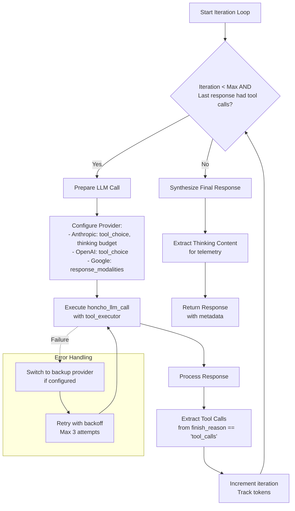
```mermaid
flowchart TD
    LOOP["Start Iteration Loop"] --> CHECK{"Iteration < Max AND
    Last response had tool calls?"}
    
    CHECK -->|Yes| PREPARE["Prepare LLM Call"]
    PREPARE --> SETUP["Configure Provider:
    - Anthropic: tool_choice, thinking budget
    - OpenAI: tool_choice
    - Google: response_modalities"]
    
    SETUP --> CALL["Execute honcho_llm_call
    with tool_executor"]
    
    CALL --> PROCESS_RESP["Process Response"]
    PROCESS_RESP --> EXTRACT["Extract Tool Calls
    from finish_reason == 'tool_calls'"]
    
    EXTRACT --> ITERATE["Increment iteration
    Track tokens"]
    ITERATE --> CHECK
    
    CHECK -->|No| SYNTHESIZE["Synthesize Final Response"]
    SYNTHESIZE --> CACHE["Extract Thinking Content
    for telemetry"]
    CACHE --> RETURN["Return Response
    with metadata"]
    
    subgraph "Error Handling"
        RETRY["Retry with backoff
    Max 3 attempts"]
        FALLBACK["Switch to backup provider
    if configured"]
    end
    
    CALL -.->|Failure| FALLBACK
    FALLBACK --> RETRY
    RETRY --> CALL
```

**LLM Call Sequence for Dialectic:**

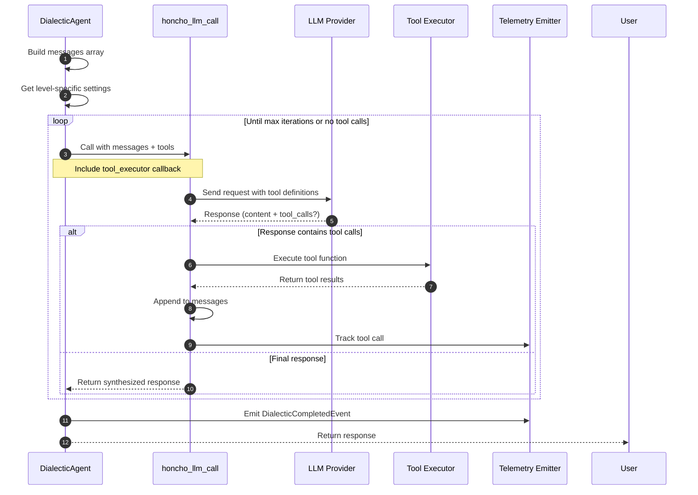
```mermaid
sequenceDiagram
    autonumber
    participant Agent as DialecticAgent
    participant LLM as honcho_llm_call
    participant Provider as LLM Provider
    participant Tool as Tool Executor
    participant Telemetry as Telemetry Emitter
    
    Agent->>Agent: Build messages array
    Agent->>Agent: Get level-specific settings
    
    loop Until max iterations or no tool calls
        Agent->>LLM: Call with messages + tools
        Note over Agent,LLM: Include tool_executor callback
        
        LLM->>Provider: Send request with tool definitions
        Provider-->>LLM: Response (content + tool_calls?)
        
        alt Response contains tool calls
            LLM->>Tool: Execute tool function
            Tool-->>LLM: Return tool results
            LLM->>LLM: Append to messages
            LLM->>Telemetry: Track tool call
        else Final response
            LLM-->>Agent: Return synthesized response
        end
    end
    
    Agent->>Telemetry: Emit DialecticCompletedEvent
    Agent-->>User: Return response
```

**Dialectic LLM Configuration by Level:**

| Level | Provider | Model | Max Tokens | Thinking Budget | Tool Choice | Max Iterations |
|-------|----------|-------|------------|-----------------|-------------|----------------|
| **minimal** | Google | gemini-2.5-flash-lite | 250 | 0 | "any" | 1 |
| **low** | Google | gemini-2.5-flash-lite | 8192 | 0 | "any" | 5 |
| **medium** | Anthropic | claude-haiku-4-5 | 8192 | 1024 | null | 2 |
| **high** | Anthropic | claude-haiku-4-5 | 8192 | 1024 | null | 4 |
| **max** | Anthropic | claude-haiku-4-5 | 8192 | 2048 | null | 10 |

### 6.4 Dreamer Specialists - Agent-Based Consolidation

Dream processing runs autonomous agent specialists that consolidate observations through iterative exploration and creation.

**Phase 0 (Optional): Surprisal Sampling (Pre-LLM)**

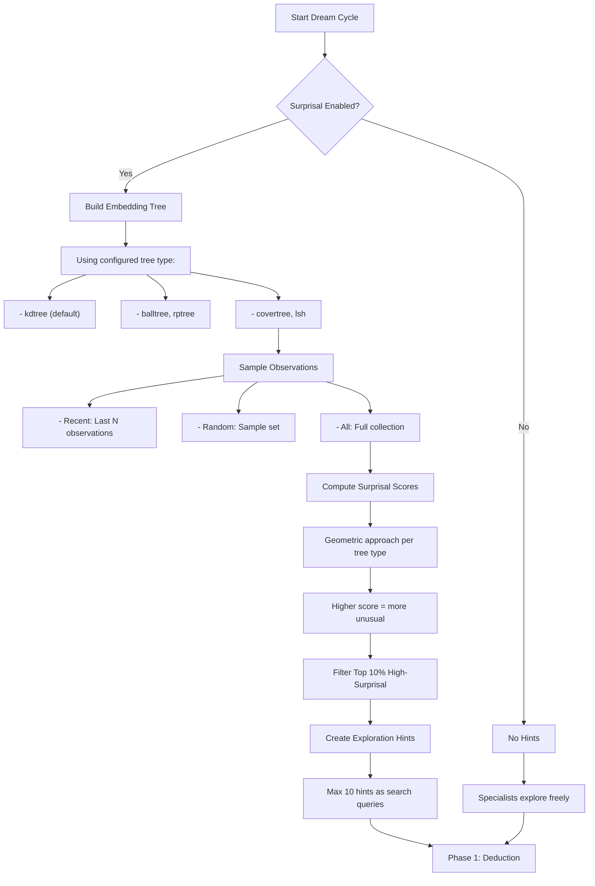
```mermaid
flowchart TD
    A["Start Dream Cycle"] --> B{"Surprisal Enabled?"}
    B -->|Yes| C["Build Embedding Tree"]
    C --> C2["Using configured tree type:"]
    C2 --> C3["- kdtree (default)"]
    C2 --> C4["- balltree, rptree"]
    C2 --> C5["- covertree, lsh"]
    
    C5 --> D["Sample Observations"]
    D --> D2["- Recent: Last N observations"]
    D --> D3["- Random: Sample set"]
    D --> D4["- All: Full collection"]
    
    D4 --> E["Compute Surprisal Scores"]
    E --> E2["Geometric approach per tree type"]
    E2 --> E3["Higher score = more unusual"]
    
    E3 --> F["Filter Top 10% High-Surprisal"]
    F --> G["Create Exploration Hints"]
    G --> G2["Max 10 hints as search queries"]
    
    B -->|No| H["No Hints"]
    H --> H2["Specialists explore freely"]
    
    G2 --> I["Phase 1: Deduction"]
    H2 --> I
```

**Phase 1-2: Specialist LLM Execution**


```mermaid
flowchart TD
    subgraph "Deduction Specialist"
        D_START["Start Specialist"] --> D2["Run ID - uuid"]
        D2 --> D_SETUP["Configure LLM"]
        D_SETUP --> D_SETUP2["Model: DEDUCTION_MODEL"]
        D_SETUP2 --> D_SETUP3["Default: claude-haiku-4-5"]
        D_SETUP3 --> D_SETUP4["Max tokens: 8192"]
        D_SETUP4 --> D_SETUP5["Max iterations: 12"]
        
        D_SETUP5 --> D_PROMPT["Build System Prompt"]
        D_PROMPT --> D_P1["- Instructions for deduction"]
        D_P1 --> D_P2["- Tool definitions"]
        D_P2 --> D_P3["- Peer card pre-fetched"]
        
        D_P3 --> D_USER["Build User Prompt"]
        D_USER --> D_U1["- Exploration hints if any"]
        D_U1 --> D_U2["- Current peer card"]
        D_U2 --> D_U3["- Instructions to explore"]
        
        D_U3 --> D_LOOP["Begin Tool Loop"]
        
        D_LOOP --> D_ITER["Iteration N"]
        D_ITER --> D_ITER2["Call LLM with available tools"]
        
        D_ITER2 --> D_EXEC["Execute Tools"]
        D_EXEC --> D_E1["- get_recent_observations"]
        D_E1 --> D_E2["- search_memory"]
        D_E2 --> D_E3["- search_messages"]
        D_E3 --> D_E4["- create_observations"]
        D_E4 --> D_E5["- delete_observations"]
        D_E5 --> D_E6["- update_peer_card"]
        
        D_E6 --> D_CHECK{"More tool calls or Max iterations?"}
        
        D_CHECK -->|Yes| D_LOOP
        D_CHECK -->|No| D_COMPLETE["Deduction Complete"]
    end
    
    subgraph "Induction Specialist"
        I_START["Start Specialist"] --> I2["Same run_id"]
        
        I2 --> I_SETUP["Configure LLM"]
        I_SETUP --> I_SETUP2["Model: INDUCTION_MODEL"]
        I_SETUP2 --> I_SETUP3["Default: claude-haiku-4-5"]
        I_SETUP3 --> I_SETUP4["Max tokens: 16384"]
        I_SETUP4 --> I_SETUP5["Max iterations: 15"]
        
        I_SETUP5 --> I_PROMPT["Build System Prompt"]
        I_PROMPT --> I_P1["- Pattern recognition focus"]
        I_P1 --> I_P2["- Tool access"]
        I_P2 --> I_P3["- Peer card updated from deduction"]
        
        I_P3 --> I_USER["Build User Prompt"]
        I_USER --> I_U1["- Same exploration hints"]
        I_U1 --> I_U2["- Current peer card"]
        I_U2 --> I_U3["- Access to new deductive obs"]
        
        I_U3 --> I_LOOP["Begin Tool Loop"]
        
        I_LOOP --> I_ITER["Iteration N"]
        I_ITER --> I_ITER2["Call LLM with induction focus"]
        
        I_ITER2 --> I_EXEC["Execute Tools"]
        I_EXEC --> I_E1["- Observations with pattern_type"]
        I_E1 --> I_E2["- create_observations inductive"]
        I_E2 --> I_E3["- update_peer_card"]
        
        I_E3 --> I_CHECK{"More tool calls or Max iterations?"}
        
        I_CHECK -->|Yes| I_LOOP
        I_CHECK -->|No| I_COMPLETE["Induction Complete"]
    end
    
    D_COMPLETE --> I_START
    I_COMPLETE --> TELEM["Emit DreamRunEvent with aggregated metrics"]
```

**Specialist LLM Tool Calling Flow:**

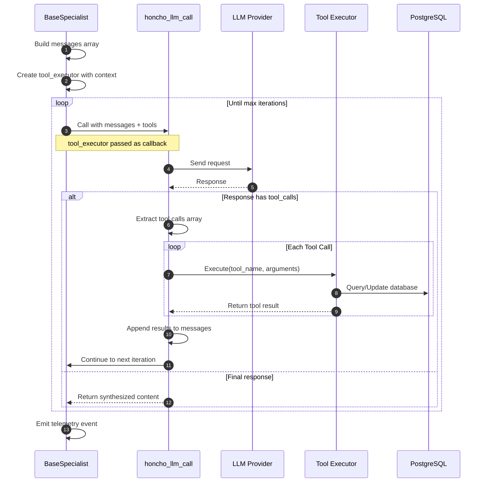
```mermaid
sequenceDiagram
    autonumber
    participant Specialist as BaseSpecialist
    participant LLM as honcho_llm_call
    participant Provider as LLM Provider
    participant Executor as Tool Executor
    participant DB as PostgreSQL
    
    Specialist->>Specialist: Build messages array
    Specialist->>Specialist: Create tool_executor with context
    
    loop Until max iterations
        Specialist->>LLM: Call with messages + tools
        Note over Specialist,LLM: tool_executor passed as callback
        
        LLM->>Provider: Send request
        Provider-->>LLM: Response
        
        alt Response has tool_calls
            LLM->>LLM: Extract tool calls array
            
            loop Each Tool Call
                LLM->>Executor: Execute(tool_name, arguments)
                Executor->>DB: Query/Update database
                Executor-->>LLM: Return tool result
            end
            
            LLM->>LLM: Append results to messages
            LLM->>Specialist: Continue to next iteration
        else Final response
            LLM-->>Specialist: Return synthesized content
        end
    end
    
    Specialist->>Specialist: Emit telemetry event
```

**Dreamer LLM Configuration:**

| Parameter | Deduction Specialist | Induction Specialist |
|-----------|---------------------|---------------------|
| Provider | Anthropic (default) | Anthropic (default) |
| Model | DEDUCTION_MODEL | INDUCTION_MODEL |
| Default Model | claude-haiku-4-5 | claude-haiku-4-5 |
| Max Output Tokens | 8,192 | 16,384 |
| Max Iterations | 12 | 15 |
| Thinking Budget | 8,192 | 8,192 |
| Tools Available | Discovery + Action | Discovery + Creation |
| Peer Card Update | Yes (biographical facts) | Yes (patterns/traits) |

---

## 6.5 LLM Client Architecture

Honcho abstracts LLM interactions through a unified client layer (`honcho_llm_call`) that supports multiple providers with consistent interface.

### 6.5.1 Unified LLM Call Interface

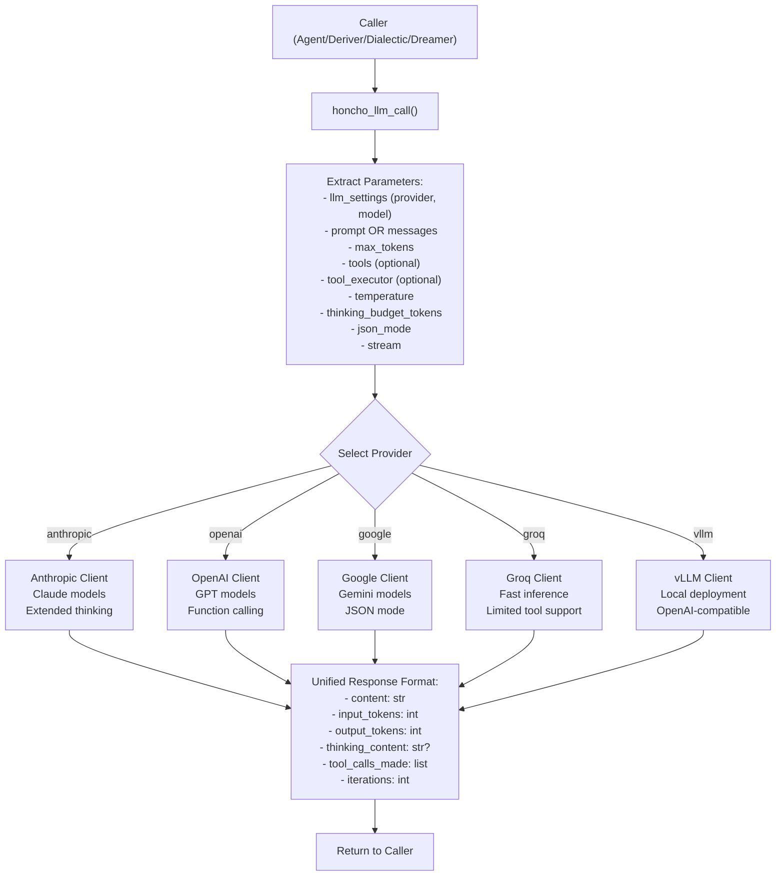
```mermaid
flowchart TD
    CALLER["Caller (Agent/Deriver/Dialectic/Dreamer)"] --> INTERFACE["honcho_llm_call()"]
    
    INTERFACE --> PARAMS["Extract Parameters:
    - llm_settings (provider, model)
    - prompt OR messages
    - max_tokens
    - tools (optional)
    - tool_executor (optional)
    - temperature
    - thinking_budget_tokens
    - json_mode
    - stream"]
    
    PARAMS --> PROVIDER{Select Provider}
    
    PROVIDER -->|anthropic| A["Anthropic Client
Claude models
Extended thinking"]
    
    PROVIDER -->|openai| O["OpenAI Client
GPT models
Function calling"]
    
    PROVIDER -->|google| G["Google Client
Gemini models
JSON mode"]
    
    PROVIDER -->|groq| GR["Groq Client
Fast inference
Limited tool support"]
    
    PROVIDER -->|vllm| V["vLLM Client
Local deployment
OpenAI-compatible"]
    
    A --> UNIFIED["Unified Response Format:
    - content: str
    - input_tokens: int
    - output_tokens: int
    - thinking_content: str?
    - tool_calls_made: list
    - iterations: int"]
    
    O --> UNIFIED
    G --> UNIFIED
    GR --> UNIFIED
    V --> UNIFIED
    
    UNIFIED --> RETURN["Return to Caller"]
```

### 6.5.2 Tool Calling Loop Architecture

When tools are provided, the LLM client manages an iterative tool execution loop:

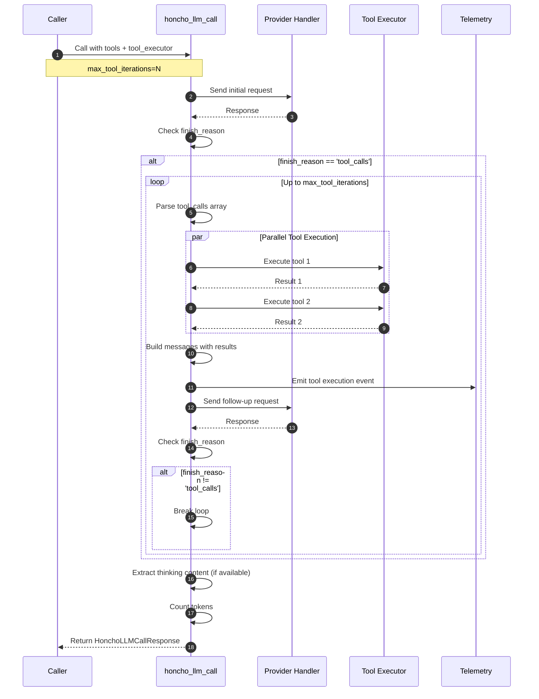
```mermaid
sequenceDiagram
    autonumber
    participant Caller
    participant LLM as honcho_llm_call
    participant Handler as Provider Handler
    participant ToolExec as Tool Executor
    participant Telemetry
    
    Caller->>LLM: Call with tools + tool_executor
    Note over Caller,LLM: max_tool_iterations=N
    
    LLM->>Handler: Send initial request
    Handler-->>LLM: Response
    
    LLM->>LLM: Check finish_reason
    
    alt finish_reason == 'tool_calls'
        loop Up to max_tool_iterations
            LLM->>LLM: Parse tool_calls array
            
            par Parallel Tool Execution
                LLM->>ToolExec: Execute tool 1
                ToolExec-->>LLM: Result 1
                
                LLM->>ToolExec: Execute tool 2
                ToolExec-->>LLM: Result 2
            end
            
            LLM->>LLM: Build messages with results
            LLM->>Telemetry: Emit tool execution event
            
            LLM->>Handler: Send follow-up request
            Handler-->>LLM: Response
            
            LLM->>LLM: Check finish_reason
            
            alt finish_reason != 'tool_calls'
                LLM->>LLM: Break loop
            end
        end
    end
    
    LLM->>LLM: Extract thinking content (if available)
    LLM->>LLM: Count tokens
    LLM-->>Caller: Return HonchoLLMCallResponse
```

### 6.5.3 Provider-Specific Configurations

| Feature | Anthropic | OpenAI | Google | Groq |
|---------|-----------|--------|--------|------|
| **Tool Choice** | `tool_choice` (any/required) | `tool_choice` | Not supported | Not supported |
| **Thinking Budget** | `thinking.budget_tokens` | Not supported | Not supported | Not supported |
| **JSON Mode** | Tool-based or prompt | `response_format: {type: "json_object"}` | `response_mime_type: application/json` | Prompt-based |
| **Structured Output** | Pydantic via tool | `response_format` with schema | Pydantic via schema | Not supported |
| **Streaming** | Yes | Yes | Yes | Limited |
| **Caching** | Prompt caching (beta) | Not supported | Not supported | Not supported |
| **Backup Provider** | Yes | Yes | Yes | No |

### 6.5.4 Retry and Fallback Logic

```mermaid
flowchart TD
    A[LLM Call Initiated] --> B{Check enable_retry}
    B -->|No| CALL["Single Attempt"]
    B -->|Yes| RETRY["Setup Retry Loop
    Max attempts: 3"]
    
    CALL --> EXEC["Execute Request"]
    RETRY --> EXEC
    
    EXEC --> RESULT{Result}
    
    RESULT -->|Success| RETURN["Return Response"]
    
    RESULT -->|Rate Limit| BACKOFF["Exponential Backoff
    Wait: 2^attempt * jitter"]
    
    RESULT -->|Auth Error| FALLBACK["Try Backup Provider
    if configured"]
    
    RESULT -->|Parse Error| FALLBACK
    
    RESULT -->|Other Error| BACKOFF
    
    BACKOFF --> RETRY2{"Attempts left?"}
    FALLBACK --> RETRY2
    
    RETRY2 -->|Yes| EXEC
    RETRY2 -->|No| ERROR["Return Error
    Log to Sentry"]
    
    RETURN --> DONE([Complete])
    ERROR --> DONE
```

### 6.5.5 Token Tracking and Limits

```mermaid
graph LR
    subgraph "Input Token Calculation"
        A[Prompt/Messages] --> B[Add System Prompt]
        B --> C[Add Tool Definitions]
        C --> D[Calculate Total]
    end
    
    subgraph "Budget Management"
        D --> E{Input < Max Input?}
        E -->|Yes| F[Proceed with Call]
        E -->|No| G["Truncate History
    (Remove oldest messages)"]
        G --> E
    end
    
    subgraph "Output Management"
        F --> H[Execute LLM Call]
        H --> I[Receive Response]
        I --> J[Count Output Tokens]
        J --> K[Cache Token Info]
    end
```

### 6.5.6 Response Streaming

For streaming responses (Dialectic chat), the LLM client manages a two-phase process:

```mermaid
flowchart TD
    A[Streaming Request] --> B["Phase 1: Tool Loop
    Execute all tool calls first
    Non-streaming"]
    
    B --> C{"Tools needed?"}
    C -->|Yes| D["Execute Tools
    Gather all context"]
    D --> E[Rebuild messages with tool results]
    E --> F["Phase 2: Final LLM Call
    stream=true"]
    C -->|No| F
    
    F --> G["Stream Response Chunks"]
    G --> H["Accumulate Content
    Track tokens"]
    H --> I[Return StreamingWithMetadata]
    
    I --> CLIENT["Client receives:
    - Async iterator of chunks
    - Metadata on completion
    (tokens, thinking content)"]
```

### 6.5.7 LLM Provider Settings by Component

```mermaid
graph TB
    subgraph "LLM Call Configuration Matrix"
        DERIVER["Deriver Agent
        Provider: DERIVER.PROVIDER
        Model: DERIVER.MODEL
        Features:
        - JSON mode: true
        - Structured output
        - No tools"]
        
        DIALECTIC_MIN["Dialectic (minimal/low)
        Provider: DIALECTIC.LEVELS[level].PROVIDER
        Model: gemini-2.5-flash-lite
        Features:
        - Tool calling
        - 1-5 iterations"]
        
        DIALECTIC_HIGH["Dialectic (medium/high/max)
        Provider: DIALECTIC.LEVELS[level].PROVIDER
        Model: claude-haiku-4-5
        Features:
        - Tool calling
        - Thinking budget
        - 2-10 iterations"]
        
        SUMMARY["Session Summary
        Provider: SUMMARY.PROVIDER
        Model: gemini-2.5-flash
        Features:
        - JSON mode available
        - Token-aware limits"]
        
        DREAM_DEDUCTION["Deduction Specialist
        Provider: DREAM.PROVIDER
        Model: DREAM.DEDUCTION_MODEL
        Features:
        - Tool calling (15 tools)
        - 12 max iterations"]
        
        DREAM_INDUCTION["Induction Specialist
        Provider: DREAM.PROVIDER
        Model: DREAM.INDUCTION_MODEL
        Features:
        - Tool calling
        - 15 max iterations"]
    end
```

### 6.5.8 Error Handling and Recovery

| Error Type | Handler Behavior | Fallback Action |
|------------|------------------|-----------------|
| **Rate Limit (429)** | Exponential backoff | Retry up to 3 times |
| **Token Limit (400)** | Truncate context | Retry with reduced input |
| **Auth Error (401/403)** | Immediate fail | Switch to backup provider |
| **Model Overload (503)** | Linear backoff | Retry or use backup |
| **JSON Parse Error** | Log validation error | Retry with same model |
| **Timeout** | Cancel request | Return partial or error |

---

### 7.1 Observation Lifecycle

```mermaid
stateDiagram-v2
    [*] --> Explicit: Message Ingestion
    
    Explicit --> Deductive: Deriver Inference
    Explicit --> Inductive: Pattern Recognition
    Explicit --> Contradiction: Conflict Detection
    
    Deductive --> Inductive: Higher-level Patterns
    Inductive --> Consolidated: Dream Processing
    Deductive --> Consolidated: Dream Processing
    Explicit --> [*]: Pruning/Deletion
    
    Consolidated --> [*]: Archive
    Contradiction --> Resolved: Manual/Agent Resolution
    Resolved --> Consolidated
```

### 7.2 Document Creation with Deduplication

```mermaid
sequenceDiagram
    autonumber
    participant Agent
    participant Lock as Async Lock
    participant Emb as Embedding Service
    participant DB as PostgreSQL
    participant Vec as Vector Store

    Agent->>Emb: Batch embed contents
    Emb-->>Agent: Embeddings

    Agent->>Lock: Acquire (workspace, observer, observed)
    
    Agent->>DB: Begin Transaction
    
    alt Deduplication Enabled
        Agent->>DB: Check existing similar documents
        DB-->>Agent: Existing matches
        
        loop For Each New Document
            Agent->>Agent: Compute similarity
            
            alt Very Similar Exists (>0.95)
                Agent->>DB: Skip Creation
            else Somewhat Similar (0.85-0.95)
                Agent->>DB: Merge/Update existing
            else Novel
                Agent->>DB: INSERT document
            end
        end
    else Deduplication Disabled
        Agent->>DB: Bulk INSERT all documents
    end
    
    Agent->>DB: Commit Transaction
    Agent->>Lock: Release
    
    Agent->>Vec: Async vector sync
```

### 7.3 Peer Card Management

Peer cards store stable biographical facts about peers.

```mermaid
graph TB
    subgraph "Peer Card Facts"
        F1["Name: Alice Johnson"]
        F2["Location: NYC"]
        F3["Occupation: Software Engineer"]
        F4["INSTRUCTION: Call me AJ"]
        F5["PREFERENCE: Concise responses"]
        F6["TRAIT: Detail-oriented"]
    end
    
    subgraph "Sources"
        M1["Message: 'I'm Alice from NYC'"]
        M2["Message: 'I work as a SWE'"]
        M3["Message: 'Please call me AJ'"]
    end
    
    subgraph "Created By"
        D[Deriver] --> F1
        D --> F2
        D --> F3
        DS[Deduction Specialist] --> F4
        DS --> F5
        DS --> F6
    end
    
    M1 -.-> F1
    M1 -.-> F2
    M2 -.-> F3
    M3 -.-> F4
```

---

## 8. Query & Retrieval System

### 8.1 Semantic Search Flow

```mermaid
sequenceDiagram
    autonumber
    participant Client
    participant API as API Endpoint
    participant Embed as Embedding Service
    participant CRUD as CRUD Layer
    participant Vec as Vector Store

    Client->>API: Query request with filters
    
    alt Pre-computed embedding
        API->>Embed: Use provided embedding
    else Need embedding
        API->>Embed: Embed query text
    end
    
    Embed-->>API: Query embedding vector
    
    API->>CRUD: query_documents()
    CRUD->>Vec: Vector similarity search
    Vec->>CRUD: Similar documents
    
    alt Filters specified
        CRUD->>CRUD: Apply level/metadata filters
    end
    
    CRUD-->>API: Filtered results
    API->>API: Format as Representation
    API-->>Client: Response
```

### 8.2 Working Representation Assembly

The working representation combines multiple query strategies:

```mermaid
flowchart TD
    A[Request Representation] --> B[Calculate Budgets]
    B --> C{Semantic Query?}
    
    C -->|Yes| D[Semantic Search<br/>~33% of budget]
    C -->|No| E[Skip]
    
    D --> F{Most Derived?}
    E --> F
    
    F -->|Both| G[Derived + Recent<br/>Three-way split]
    F -->|Yes only| H[Derived + Recent<br/>Two-way split]
    F -->|No| I[Recent Only<br/>100% to recent]
    
    G --> J[Merge Results]
    H --> J
    I --> J
    
    J --> K[Deduplicate<br/>Remove overlaps]
    K --> L[Sort by Age/Derivation]
    L --> M[Return Representation]
```

### 8.3 Available Query Methods

| Method | Description | Use Case |
|--------|-------------|----------|
| **Semantic Search** | Vector similarity on observation content | Find relevant observations |
| **Recent Observations** | Most recent by timestamp | Understand recent developments |
| **Most Derived** | By `times_derived` count | Find established facts |
| **Grep Search** | Exact text matching | Find specific phrases |
| **Date Range** | Temporal filtering | Time-bounded queries |
| **Hybrid Search** | Semantic + temporal | Recent mentions of topic |

---

## 9. Session Management

### 9.1 Session Context Retrieval

The `get_session_context` endpoint returns comprehensive session data:

```mermaid
flowchart TD
    A[Context Request] --> B[Token Budget Calculation]
    B --> C[40% for Summary]
    C --> D[60% for Messages]
    
    D --> E{Include Summary?}
    E -->|Yes| F[Fetch Short & Long Summaries]
    F --> G{Select Best Summary}
    G -->|Long fits better| H[Use Long Summary]
    G -->|Short fits better| I[Use Short Summary]
    G -->|None fit| J[No Summary]
    
    H --> K[Adjust Message Budget]
    I --> K
    J --> L[Full Budget for Messages]
    
    K --> M[Fetch Recent Messages]
    L --> M
    
    M --> N{Include Peer Context?}
    N -->|Yes| O[Fetch Representation]
    N -->|Yes| P[Fetch Peer Card]
    N -->|No| Q[Skip]
    
    O --> R[Assemble Response]
    P --> R
    Q --> R
    R --> S[Return SessionContext]
```

### 9.2 Summary Generation with LLM

Session summaries are generated at configurable intervals using LLM calls to condense conversation history.

**Summary Trigger Conditions:**

```mermaid
flowchart TD
    A[Message Created] --> B[Check seq_in_session]
    B --> C{Modulo Check}
    
    C -->|seq % messages_per_short_summary == 0| SHORT["Trigger SHORT Summary
    Default: Every 20 messages"]
    
    C -->|seq % messages_per_long_summary == 0| LONG["Trigger LONG Summary
    Default: Every 60 messages"]
    
    C -->|No match| SKIP["Skip Summary"]
    
    SHORT --> D["Prepare LLM Call:
    - Provider: SUMMARY.PROVIDER
    - Model: gemini-2.5-flash
    - Max tokens: 1000"]
    
    LONG --> E["Prepare LLM Call:
    - Provider: SUMMARY.PROVIDER
    - Model: gemini-2.5-flash
    - Max tokens: 4000"]
    
    D --> FORMAT["Format Messages with Timestamps
    Up to token limit"]
    E --> FORMAT
    
    FORMAT --> LLM_CALL["Execute honcho_llm_call
    - System prompt: Summarization instructions
    - JSON mode: optional
    - Thinking budget: 512"]
    
    LLM_CALL --> PARSE["Parse LLM Output"]
    PARSE --> STORE["Store in internal_metadata:
    - content: summary text
    - message_id: coverage end
    - summary_type: short/long
    - token_count: calculated"]
    
    STORE --> DONE([Complete])
```

**Summary LLM Configuration:**

| Parameter | Short Summary | Long Summary |
|-----------|---------------|--------------|
| Trigger | Every 20 messages | Every 60 messages |
| Provider | Google (default) | Google (default) |
| Model | gemini-2.5-flash | gemini-2.5-flash |
| Max Tokens | 1,000 | 4,000 |
| Thinking Budget | 512 | 512 |
| Temperature | Default | Default |
| JSON Mode | Optional | Optional |

**Two-Tier Summary Strategy:**

```mermaid
timeline
    title Session Summary Generation
    section Init
        Messages 1-20 : Short summary triggered
                      : (after 20 messages)
                      
    section Short
        Messages 21-60 : Short summaries every 20
        
    section Long  
        After 60 messages : Long summary triggered
        Messages 61+      : Long summaries every 60
                         : Short continues every 20
```

### 9.3 Multi-Peer Session Flow

```mermaid
sequenceDiagram
    autonumber
    participant Alice
    participant Bob
    participant System as Honcho System
    participant Queue as Deriver Queue

    Alice->>System: create_session(id="meeting-1")
    System-->>Alice: Session created
    
    Alice->>System: add_peers(["alice", "bob"])
    System-->>Alice: Peers added
    
    Alice->>System: send_message("Let's discuss the project")
    System->>Queue: Enqueue representation
    Queue->>Queue: Process for Alice→Alice
    Queue->>Queue: Process for Bob→Alice (if observe_others)
    
    Bob->>System: send_message("Sure, here's my update...")
    System->>Queue: Enqueue representation
    Queue->>Queue: Process for Bob→Bob
    Queue->>Queue: Process for Alice→Bob (if observe_others)
    
    Bob->>System: chat("What did Alice want to discuss?")
    System->>System: Query observations
    System-->>Bob: "Alice wanted to discuss the project"
```

### 9.4 Context Management & Token Limits

Honcho uses a **three-tier hierarchical approach** to keep agent context below configurable thresholds:

```mermaid
graph TB
    subgraph "Context Management Strategy"
        A["1. Configuration Level"] --> B["2. API-Level Budgeting"]
        B --> C["3. Database-Level Enforced"]
    end
    
    subgraph "Token Budget Allocation"
        D["Total Budget: 100K tokens default"] 
        E["40% to Summary"]
        F["60% to Messages"]
        D --> E
        D --> F
    end
```

#### Configuration-Level Defaults

| Setting | Default | Max | Description |
|---------|---------|-----|-------------|
| `GET_CONTEXT_MAX_TOKENS` | 100,000 | 250,000 | Default limit for context retrieval endpoints |
| `SUMMARY.MAX_TOKENS_SHORT` | 1,000 | 10,000 | Maximum tokens for short summaries |
| `SUMMARY.MAX_TOKENS_LONG` | 4,000 | 20,000 | Maximum tokens for long summaries |

```mermaid
flowchart LR
    subgraph "Configuration Hierarchy"
        A["Message Config"] --> B["Session Config"]
        B --> C["Peer Config"]
        C --> D["Workspace Config"]
        D --> E["Default: 100K"]
    end
```

#### API-Level Token Budgeting (40/60 Allocation)

When `/sessions/{id}/context` is called:

```mermaid
flowchart TD
    A["Context Request Received"] --> B{"Token Limit Specified?"}
    B -->|Yes| C["Use User-Provided Limit"]
    B -->|No| D["Use GET_CONTEXT_MAX_TOKENS default"]
    
    C --> E["Calculate Budgets"]
    D --> E
    
    E --> F["40% to Summary"]
    E --> G["60% to Messages"]
    
    F --> H{"Long Summary Fit?"}
    H -->|Yes| I["Use Long Summary<br/>60 msgs + metadata"]
    H -->|No| J{"Short Summary Fit?"}
    J -->|Yes| K["Use Short Summary<br/>20 msgs + metadata"]
    J -->|No| L["Skip Summary<br/>Full budget for messages"]
    
    I --> M["Adjust Message Budget"]
    K --> M
    L --> N["Full Budget Available"]
```

#### Database-Level Enforcement

The `_apply_token_limit` function uses SQL window functions to enforce token budgets:

```mermaid
flowchart LR
    A[Database Query] --> B["Window Function<br/>SUM(token_count)<br/>OVER (ORDER BY id DESC)"]
    B --> C["WHERE running_sum<br/><= token_limit"]
    C --> D["Return Most Recent<br/>Messages Under Budget"]
```

#### Summary Selection Logic

```mermaid
flowchart TD
    A[Fetch Both Summaries] --> B{"Long Summary Exists?"}
    B -->|Yes| C{"Long Len <= 40% Budget?"}
    C -->|Yes| D{"Long Len > Short Len?"}
    D -->|Yes| E["SELECT Long Summary"]
    D -->|No| F["Check Short Summary"]
    
    C -->|No| F
    B -->|No| F
    
    F -->|Yes| G["SELECT Short Summary"]
    G --> D2{"Short Len > 0?"}
    D2 -->|Yes| H["Use Short and Remaining Budget"]
    D2 -->|No| I["No Summary and Full Budget"]
```

**Selection Priority:**
1. Long summary if it fits AND is longer than short
2. Short summary if it fits
3. No summary (full token budget for messages)

#### Two-Tier Summary System

| Summary Type | Trigger | Coverage | Token Budget Allocation |
|--------------|---------|----------|------------------------|
| **Short** | Every 20 messages | Last 20 messages | ~1,000 tokens max |
| **Long** | Every 60 messages | Last 60 messages | ~4,000 tokens max |

```mermaid
timeline
    title Session Summary Generation Timeline
    section Message 20
        Short Summary : Generated
                      : Covers 1-20
    section Message 40
        Short Summary : Generated
                      : Covers 21-40
    section Message 60
        Short Summary : Generated
        Long Summary  : Covers 1-60
                      : (supersedes shorts)
    section Continuing
        Every 20 msgs : Short summary
        Every 60 msgs : Long summary
```

#### Agent-Specific Context Limits

Each Honcho agent has its own internal token limits:

| Agent | Context Limit | Notes |
|-------|--------------|-------|
| **Deriver** | 23,000 (`MAX_INPUT_TOKENS`) | For batch observation processing |
| **Dialectic** | Configurable per level (1K-16K) | `HISTORY_TOKEN_LIMIT` |
| **Dreamer** | 16,384 | `HISTORY_TOKEN_LIMIT` for specialists |
| **Summarization** | 100-4K | Based on summary type |

#### Example: 10K Token Limit Flow

```
User requests context with 10K token limit
|├──✓ Check: Long summary available? (3.2K tokens)
|   ├──✓ Fits in 4K budget (40% of 10K)
|   ├──✓ Use Long Summary
|       └── Remaining: 6.8K for messages
|└── Fetch: Recent messages up to 6.8K tokens
    └── Return: { summary: "...", messages: [...] }
```

This multi-layer approach ensures context never exceeds limits while maximizing useful information for AI agents.

---

## 10. Configuration System

### 10.1 Configuration Hierarchy & Resolution

```mermaid
graph TD
    subgraph "Configuration Sources"
        ENV["Environment Variables<br/>Highest Priority"]
        DOTENV[".env File"]
        TOML["config.toml"]
        DEFAULT["Default Values<br/>Lowest Priority"]
    end
    
    ENV --> RESOLVE
    DOTENV --> RESOLVE
    TOML --> RESOLVE
    DEFAULT --> RESOLVE
    
    subgraph "Scoped Resolution"
        RESOLVE[Configuration Resolver]
        RESOLVE --> MSG[Message-level]
        RESOLVE --> SESS[Session-level]
        RESOLVE --> PEER[Peer-level]
        RESOLVE --> WKSP[Workspace-level]
        RESOLVE --> DEF[Default]
    end
```

### 10.2 Feature Flags

Configuration enables fine-grained control:

| Feature | Levels | Description |
|---------|--------|-------------|
| `reasoning.enabled` | msg/sess/peer/workspace | Derive observations from messages |
| `summary.enabled` | msg/sess/peer/workspace | Generate session summaries |
| `dream.enabled` | msg/sess/peer/workspace | Enable dream processing |
| `peer_card.create` | msg/sess/peer/workspace | Generate peer cards |
| `observe_me` | sess-peer/peer | Peer observes self |
| `observe_others` | sess-peer | Peer observes others |

### 10.3 LLM Provider Configuration

Different components can use different LLM providers:

| Component | Default Provider | Default Model | Purpose |
|-----------|-----------------|---------------|---------|
| Deriver | Google | gemini-2.5-flash-lite | Fast observation extraction |
| Dialectic (minimal) | Google | gemini-2.5-flash-lite | Cost-efficient queries |
| Dialectic (medium+) | Anthropic | claude-haiku-4-5 | High-quality reasoning |
| Summary | Google | gemini-2.5-flash | Session summarization |
| Dreamer | Anthropic | claude-sonnet-4-20250514 | Observation consolidation |
| Deduction Specialist | Anthropic | claude-haiku-4-5 | Logical inference |
| Induction Specialist | Anthropic | claude-haiku-4-5 | Pattern recognition |

---

## 11. Security & Authentication

### 11.1 JWT Structure

Honcho uses JWT tokens for authentication with hierarchical scoping:

```
Header:
{
  "alg": "HS256",
  "typ": "JWT"
}

Payload:
{
  "w": "workspace-id",       // Workspace scope (optional)
  "p": "peer-id",            // Peer scope (optional)
  "s": "session-id",         // Session scope (optional)
  "ad": true,                // Admin flag (optional)
  "exp": 1704067200,         // Expiration
  "iat": 1704063600          // Issued at
}
```

### 11.2 Authorization Flow

```mermaid
flowchart TD
    A[JWT Received] --> B{Admin scope?}
    B -->|Yes| C[Grant Full Access]
    B -->|No| D{Workspace match?}
    
    D -->|No| E[Deny Access]
    D -->|Yes| F{Has Peer scope?}
    
    F -->|No| G{Has Session scope?}
    F -->|Yes| H{Peer matches?}
    
    H -->|No| E
    H -->|Yes| G
    
    G -->|No| I[Grant Workspace Access]
    G -->|Yes| J{Session matches?}
    
    J -->|No| E
    J -->|Yes| K[Grant Scoped Access]
    
    C --> GRANTED[Access Granted]
    I --> GRANTED
    K --> GRANTED
    E --> DENIED[401/403 Response]
```

---

## 12. Telemetry & Monitoring

### 12.1 Event Types

```mermaid
graph TB
    subgraph "Telemetry Events"
        DIALECTIC["Dialectic Events
- DialecticCompletedEvent"]
        
        DREAM["Dream Events
- DreamRunEvent
- DreamSpecialistEvent"]
        
        REP["Representation Events
- RepresentationCompletedEvent"]
        
        AGENT["Agent Tool Events
- AgentToolConclusionsCreatedEvent
- AgentToolConclusionsDeletedEvent
- AgentToolPeerCardUpdatedEvent"]
        
        LIFECYCLE["Lifecycle Events
- DeletionCompletedEvent
- CleanupStaleItemsCompletedEvent
- SyncVectorsCompletedEvent"]
        
        API["API Events
- API Request Metrics"]
    end
    
    subgraph "Destinations"
        PROM["Prometheus
Pull-based metrics"]
        CLOUD["CloudEvents
HTTP endpoint"]
        SENTRY_MONITOR[Sentry
Error tracking]
    end
    
    DIALECTIC --> CLOUD
    DREAM --> CLOUD
    REP --> CLOUD
    AGENT --> CLOUD
    LIFECYCLE --> CLOUD
    
    API --> PROM
    LIFECYCLE --> PROM
    AGENT --> SENTRY_MONITOR
```

### 12.2 Metrics Collection

| Category | Metrics | Collection Method |
|----------|---------|-------------------|
| **API** | Request count, latency, status codes | Prometheus + Middleware |
| **Deriver** | Token usage, processing time, observation counts | CloudEvents + Prometheus |
| **Dialectic** | Token usage, tool calls, reasoning level | CloudEvents + Telemetry |
| **Dreamer** | Specialist runs, iterations, duration | CloudEvents + Session metrics |
| **Vector** | Sync state, sync attempts, latency | Database + Telemetry |

### 12.3 Performance Tracking

Key performance indicators:

```python
# Deriver Performance
- Context preparation time
- LLM call duration
- Documents saved per batch
- Queue processing latency

# Dialectic Performance
- Total response time
- Tool iteration count
- Token usage per query
- Cache hit rate

# Dreamer Performance
- Surprisal computation time
- Specialist iteration count
- Observations created per cycle
- Total dream duration
```

---

## Appendix A: API Resource Summary

| Resource | Operations | Notes |
|----------|------------|-------|
| **Workspaces** | Create, List, Update, Delete | Root organizational unit |
| **Peers** | Create, Get, Update, Chat, Representation, Card, Context, Search | Unified entity model |
| **Sessions** | Create, List, Update, Delete, Clone, Peers, Context, Summaries | Multi-peer conversations |
| **Messages** | Create (batch), List, Get, Update, Search | Chronological with sequence |
| **Conclusions** | Bulk Create, Query, Delete | Observation documents |
| **Keys** | Create | Scoped JWT generation |
| **Webhooks** | Create, List, Delete | Event subscriptions |

## Appendix B: Task Queue Reference

| Task Type | Trigger | Handler | Priority |
|-----------|---------|---------|----------|
| `representation` | Message creation | `process_representation_batch()` | High |
| `summary` | Message threshold | `summarizer.summarize_if_needed()` | Medium |
| `dream` | Schedule/collection size | `process_dream()` | Low |
| `deletion` | Async delete request | `process_deletion()` | High |
| `webhook` | Various events | `webhook_delivery.deliver_webhook()` | Medium |
| `reconciler` | Scheduled | Run sync/cleanup tasks | Low |

## Appendix C: Reasoning Levels - Detailed LLM Configuration

| Level | Provider | Model | Max Iterations | Thinking Budget | Tool Choice | Max Output Tokens | Use Case |
|-------|----------|-------|----------------|-----------------|-------------|-------------------|----------|
| **minimal** | Google | gemini-2.5-flash-lite | 1 | 0 | "any" | 250 | Simple lookups with single tool call, no deep reasoning |
| **low** | Google | gemini-2.5-flash-lite | 5 | 0 | "any" | 8,192 | Standard queries with multiple exploration steps |
| **medium** | Anthropic | claude-haiku-4-5 | 2 | 1,024 | null | 8,192 | Complex reasoning with explicit thinking budget |
| **high** | Anthropic | claude-haiku-4-5 | 4 | 1,024 | null | 8,192 | Deep analysis with extended tool iteration |
| **max** | Anthropic | claude-haiku-4-5 | 10 | 2,048 | null | 8,192 | Maximum reasoning with deep exploration |

**LLM Provider Configuration Summary:**

| Provider | Models Used | Best For |
|----------|-------------|----------|
| **Google** | gemini-2.5-flash-lite, gemini-2.5-flash | Bulk processing, summaries, speed-oriented tasks |
| **Anthropic** | claude-haiku-4-5, claude-sonnet-4-20250514 | High-quality reasoning, dialectic, dream consolidation |
| **OpenAI** | gpt-4o, gpt-4o-mini | Alternative for dialectic, tool calling |
| **Groq** | llama-3.x variants | Fast inference (no tool support) |

**Per-Request LLM Cost Optimization:**

```mermaid
graph TD
    A[Request Incoming] --> B{Query Type?}
    
    B -->|Simple Lookup| C["Use: minimal
    Provider: Google
    Cost: Lowest"]
    
    B -->|Standard Query| D["Use: low
    Provider: Google
    Cost: Low"]
    
    B -->|Complex Analysis| E["Use: medium
    Provider: Anthropic
    Cost: Medium"]
    
    B -->|Deep Reasoning| F["Use: high/max
    Provider: Anthropic
    Cost: Higher"]
    
    C --> CACHE["Check Cache"]
    D --> CACHE
    E --> CACHE
    F --> CACHE
    
    CACHE -->|Cache Hit| RETURN["Return Cached"]
    CACHE -->|Cache Miss| LLM["Execute LLM Call"]
    
    LLM --> STORE["Store Result"]
    STORE --> RETURN2["Return Response"]
```

---

*End of Requirements Document*
