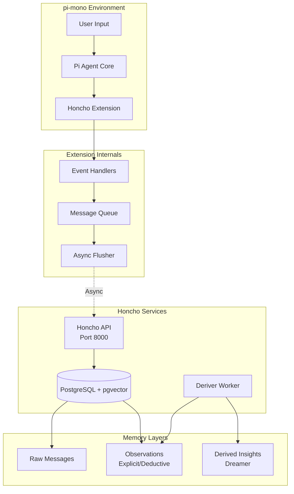
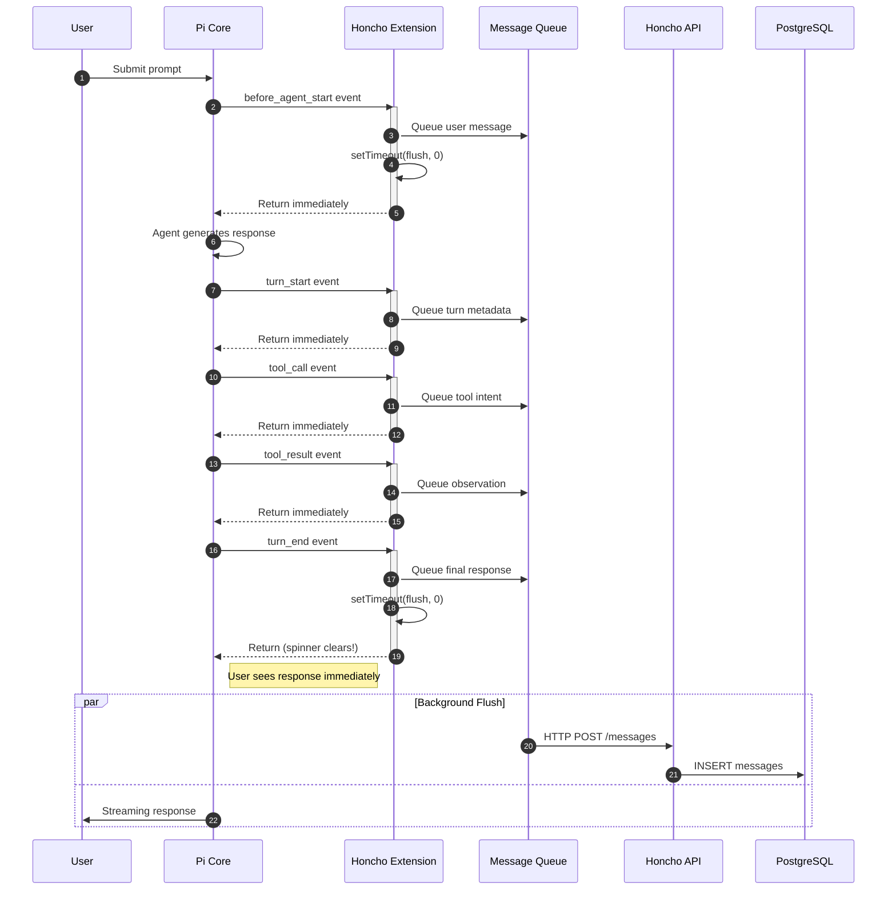
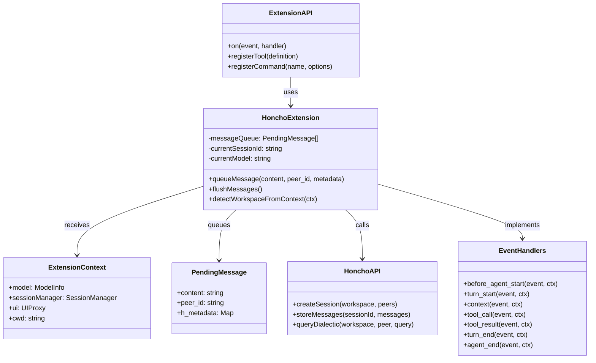
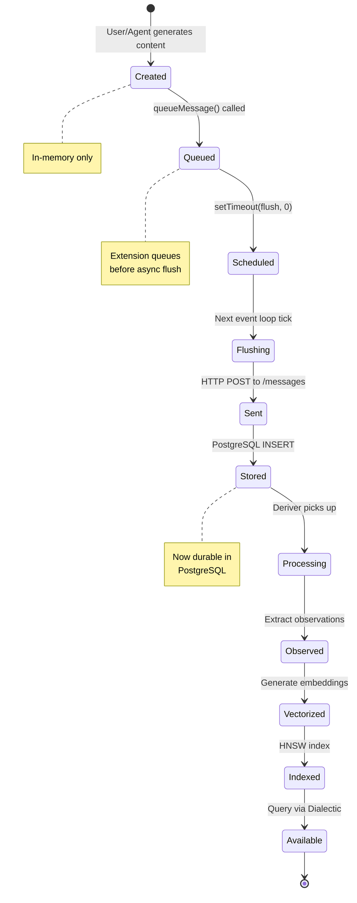
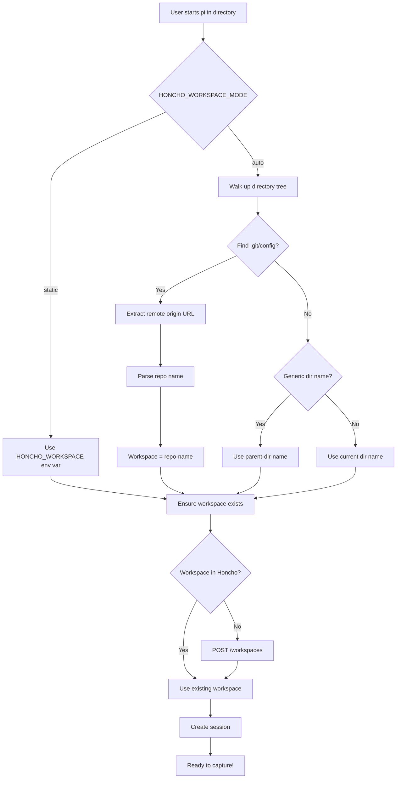
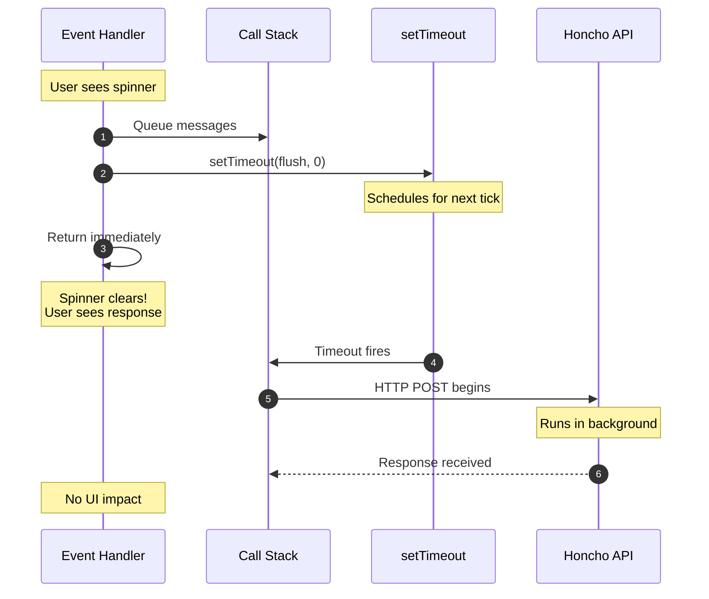

# Honcho Extension for pi-mono - README

A pi-mono extension that captures the **complete ReAct cycle** for maximum Dreamer + Dialectic intelligence.

## Quick Reference

- **Extension File**: `~/.pi/agent/extensions/honcho.ts`
- **Configuration**: `~/.env`
- **Services**: `honcho-api.service`, `honcho-deriver.service`
- **API URL**: http://localhost:8000

---

## Architecture & Program Flow

### System Architecture



### Event-Driven Data Flow



### Object Interactions



### Message Lifecycle



### Workspace Detection Flow



### Async Flush Pattern



---

## Features

### Automatic Session Management
- Automatically creates a new Honcho session when pi starts
- Tracks conversations and stores them in Honcho  
- Session ID persists until pi reload

### Dynamic Workspace Detection
- **Mode: `auto` (default)**
- Detects git repository name from `remote origin`
- Falls back to directory name with parent context
- Auto-creates workspace in Honcho if missing

Example:
```bash
cd ~/projects/honcho && pi     # Workspace: "honcho"
cd ~/my-api/src && pi         # Workspace: "my-api-src"
```

### Full ReAct Trace Capture

| Step | What's Captured | Metadata |
|------|-----------------|----------|
| User Prompt | Full text + images | `type: "prompt"`, `intended_model` |
| Agent Thought | Reasoning/planning | `type: "thought"`, `step: "planning"` |
| Tool Call | Tool name + args | `type: "tool_call"`, `tool: "bash"` |
| Tool Output | stdout/stderr | `type: "observation"`, `status: "success"` |
| Final Response | Complete output | `type: "final"`, `role: "assistant"` |

---

## Configuration

Add to your `~/.env`:

```bash
# Required
HONCHO_BASE_URL=http://localhost:8000
HONCHO_USER=<user>

# Optional (defaults shown)  
HONCHO_AGENT_ID=agent-pi-mono
HONCHO_WORKSPACE_MODE=auto       # "auto" or "static"
HONCHO_WORKSPACE=default         # Used when mode=static
```

---

## Available Tools

### `honcho_store`
Manually store a message in Honcho.

```
honcho_store
  content: "Important information to remember"
  peer_id: "user" (optional)
  metadata: { custom: "data" }
```

### `honcho_chat`
Query Honcho's Dialectic for answers about stored memories.

```
honcho_chat
  query: "What approach did I use for database migrations?"
  reasoning_level: "low" (optional: minimal/low/medium/high/max)
```

### `honcho_insights`
Get personalization insights about your coding style.

```
honcho_insights
  question: "What are my common debugging patterns?"
```

### `honcho_context`
Retrieve recent conversation context.

```
honcho_context
  tokens: 4000
  include_summary: true
```

### `honcho_search`
Search across all sessions.

```
honcho_search
  query: "jwt authentication"
  limit: 10
```

---

## Commands

| Command | Description |
|---------|-------------|
| `/honcho-start` | Create new session (flushes current) |
| `/honcho-status` | Show connection + pending messages |
| `/honcho-flush` | Manually flush pending messages |

---

## Systemd Integration

Services run automatically via systemd user services:

```bash
# Status
systemctl --user status honcho-api honcho-deriver

# Logs
journalctl --user -u honcho-api -f

# Restart
systemctl --user restart honcho-api
```

---

## What Gets Learned

With the full trace, Honcho's Dreamer extracts:

- **Your coding style** - preferred patterns, naming conventions
- **Common pitfalls** - errors you hit frequently  
- **Project architecture** - how you structure code
- **Debugging patterns** - what you check first
- **Tool preferences** - when you use grep vs find vs read
- **Decision rationale** - why you chose approach X over Y
- **Model effectiveness** - which LLM performs best for you

---

## Troubleshooting

### Extension not loading
- Check TypeScript syntax: `pi -e ./honcho.ts` to test
- Verify `HONCHO_BASE_URL` is set correctly
- Ensure Honcho API is running: `curl http://localhost:8000`

### Messages not appearing
- Check `/honcho-status` for pending count
- Run `/honcho-flush` to force store
- Verify workspace exists in Honcho

### "Working" spinner stuck
- Fixed: All flushes now use `setTimeout(..., 0)`
- Extension returns immediately, flush runs in background

---

## Implementation Notes

### Async Design Pattern

All event handlers use **fire-and-forget** pattern:

```typescript
// Don't block UI
setTimeout(() => {
  flushMessages().catch(err => console.error(err));
}, 0);
```

This ensures pi's "Working" spinner clears immediately while HTTP requests run in the background.

### Message Queue

Messages are batched in memory until flush:
- User messages queued first
- Tool calls/observations queued as they happen  
- Final response queued on `turn_end`
- Single HTTP POST sends all messages atomically

### Error Handling

- Failed flushes are caught and logged to console only
- No UI interruption on network errors
- Messages remain in queue for next flush attempt

---

## References

- [Honcho Documentation](https://docs.honcho.dev)
- [pi-mono Extensions](https://github.com/mariozechner/pi-coding-agent/blob/main/docs/extensions.md)
- [systemd User Services](https://wiki.archlinux.org/title/Systemd/User)
