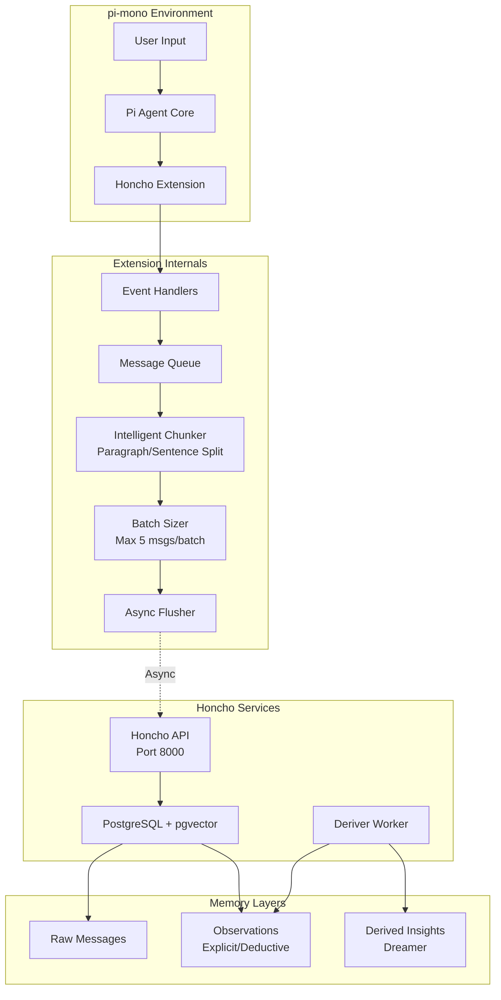
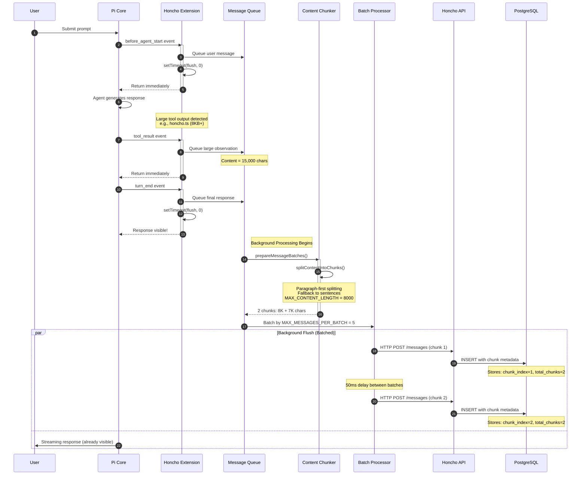
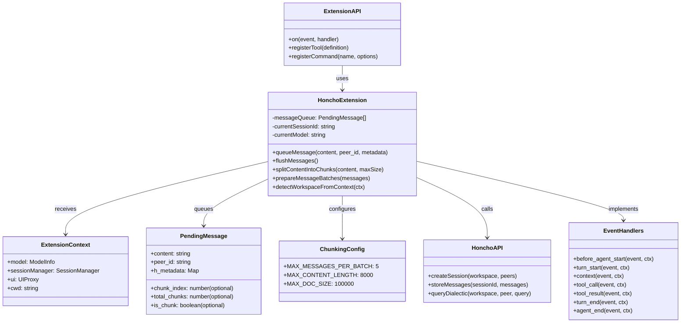
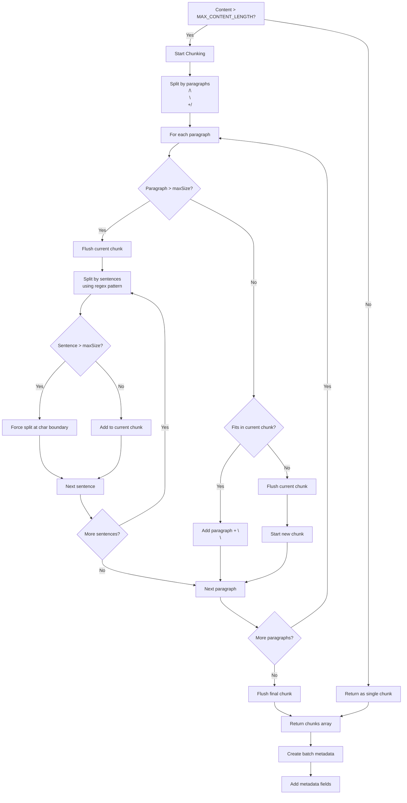
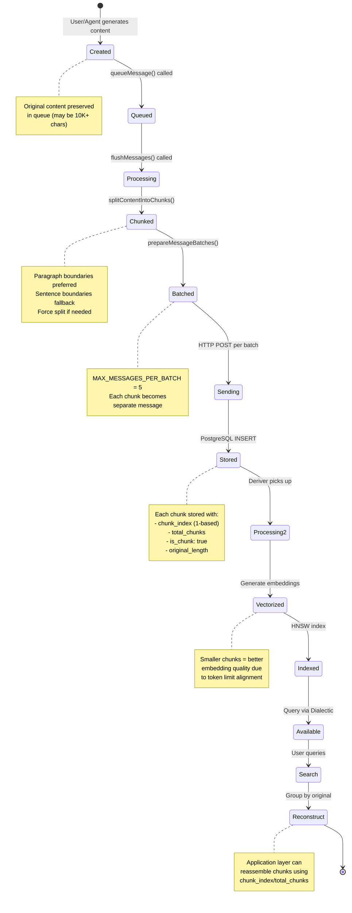
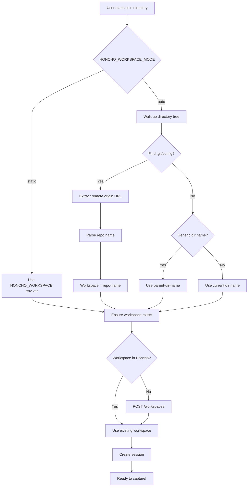
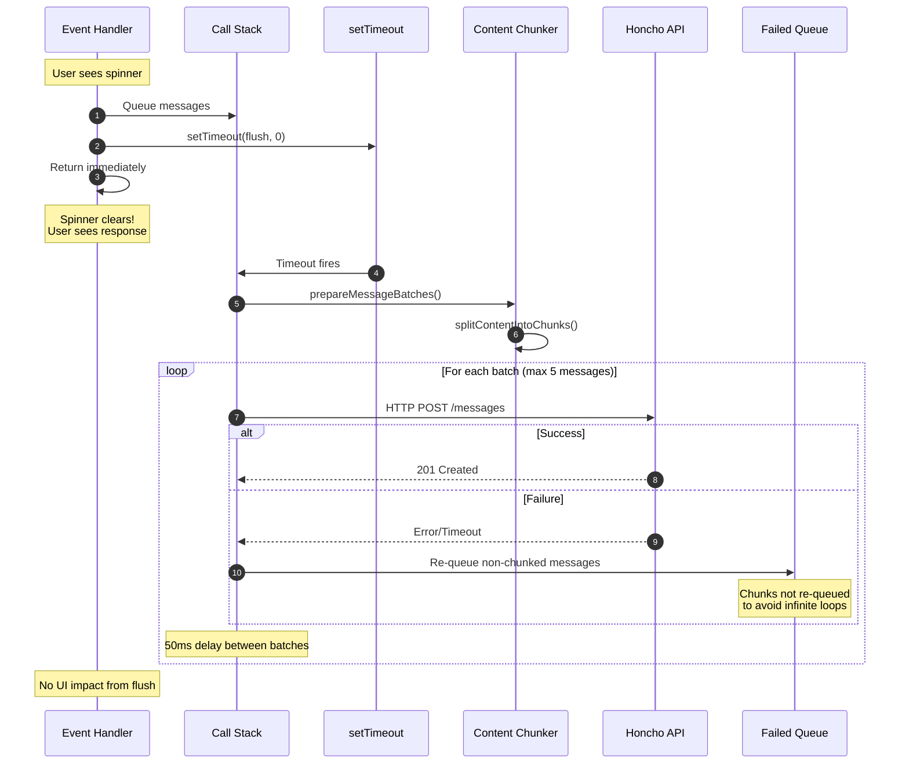
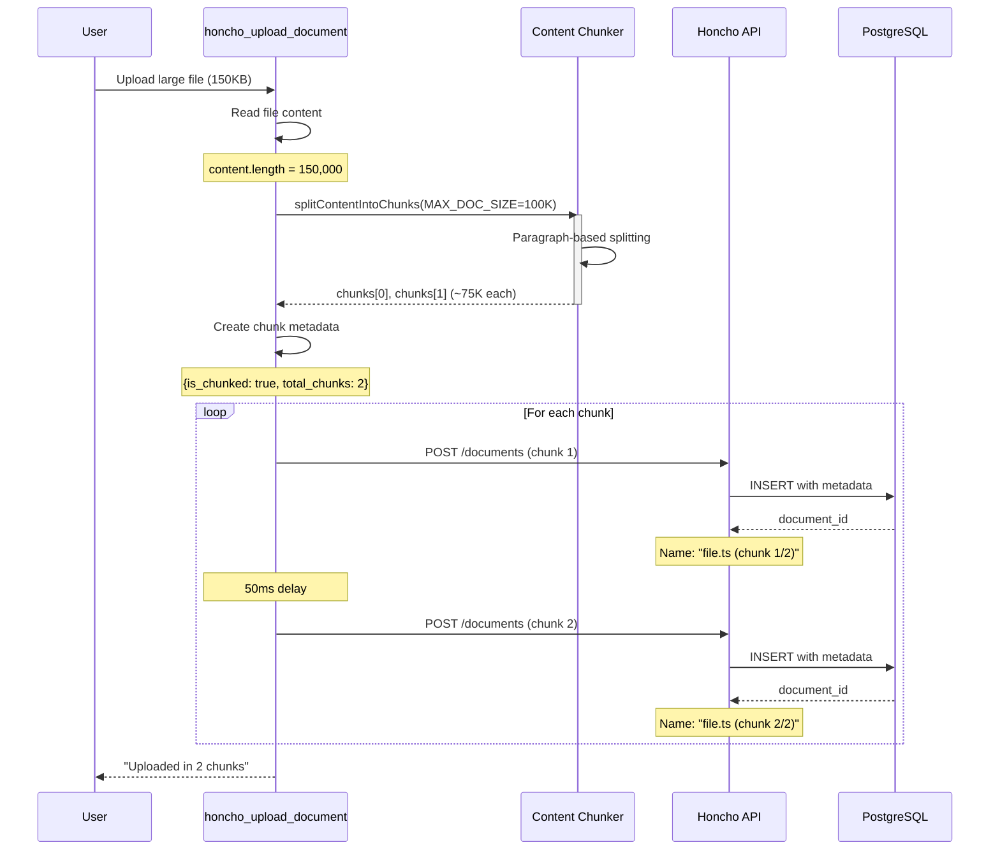

# Honcho Extension for pi-mono - README

A pi-mono extension that captures the **complete ReAct cycle** for maximum Dreamer + Dialectic intelligence, with **intelligent content chunking** for large messages and documents.

## Quick Reference

- **Extension File**: `~/.pi/agent/extensions/honcho.ts`
- **Configuration**: `~/.env`
- **Services**: `honcho-api.service`, `honcho-deriver.service`
- **API URL**: http://localhost:8000

---

## Architecture & Program Flow

### System Architecture



### Event-Driven Data Flow with Chunking



### Object Interactions



### Chunking Algorithm Flow



### Message Lifecycle with Chunking



### Workspace Detection Flow



### Async Flush Pattern with Retry



### Document Upload Chunking



---

## Features

### Automatic Session Management
- Automatically creates a new Honcho session when pi starts
- Tracks conversations and stores them in Honcho  
- Session ID persists until pi reload

### Dynamic Workspace Detection
- **Mode: `auto` (default)**
- Detects git repository name from `remote origin`
- Falls back to directory name with parent context
- Auto-creates workspace in Honcho if missing

Example:
```bash
cd ~/projects/honcho && pi     # Workspace: "honcho"
cd ~/my-api/src && pi         # Workspace: "my-api-src"
```

### Full ReAct Trace Capture with Chunking

| Step | What's Captured | Metadata |
|------|-----------------|----------|
| User Prompt | Full text + images | `type: "prompt"`, `intended_model` |
| Agent Thought | Reasoning/planning | `type: "thought"`, `step: "planning"` |
| Tool Call | Tool name + args | `type: "tool_call"`, `tool: "bash"` |
| Tool Output | stdout/stderr | `type: "observation"`, `will_be_chunked: true` |
| Final Response | Complete output | `type: "final"`, `role: "assistant"` |

### Intelligent Content Chunking

**For Large Messages:**
- **Threshold**: `MAX_CONTENT_LENGTH = 8000` chars (~250-400 tokens)
- **Strategy**: Paragraph boundaries → Sentence boundaries → Character boundaries
- **Batch Size**: `MAX_MESSAGES_PER_BATCH = 5` messages per HTTP request
- **Metadata**: Each chunk includes `chunk_index`, `total_chunks`, `original_length`, `is_chunk`

**For Document Uploads:**
- **Threshold**: `MAX_DOC_SIZE = 100000` chars (~100KB)
- **Strategy**: Same paragraph-based chunking as messages
- **Storage**: Each chunk becomes separate document with linking metadata

---

## Configuration

Add to your `~/.env`:

```bash
# Required
HONCHO_BASE_URL=http://localhost:8000
HONCHO_USER=dsidlo

# Optional (defaults shown)  
HONCHO_AGENT_ID=agent-pi-mono
HONCHO_WORKSPACE_MODE=auto       # "auto" or "static"
HONCHO_WORKSPACE=default         # Used when mode=static
```

---

## Available Tools

### `honcho_store`
Manually store a message in Honcho. Large content is automatically chunked.

```
honcho_store
  content: "Important information to remember... (can be 10K+ chars)"
  peer_id: "user" (optional)
  metadata: { custom: "data" }
```

**Response includes:**
- `chunked: true/false` - Whether content was split
- `chunks: N` - Number of chunks created

### `honcho_chat`
Query Honcho's Dialectic for answers about stored memories.

```
honcho_chat
  query: "What approach did I use for database migrations?"
  reasoning_level: "low" (optional: minimal/low/medium/high/max)
```

### `honcho_insights`
Get personalization insights about your coding style.

```
honcho_insights
  question: "What are my common debugging patterns?"
```

### `honcho_context`
Retrieve recent conversation context (reconstructed from chunks).

```
honcho_context
  tokens: 4000
  include_summary: true
```

### `honcho_search`
Search across all sessions (handles chunked content).

```
honcho_search
  query: "jwt authentication"
  limit: 10
```

### `honcho_upload_document`
Upload a file or document. Large files are intelligently chunked.

```
honcho_upload_document
  file_path: "/path/to/large-file.ts"
  name: "my-file" (optional)
  metadata: { language: "typescript" }
  level: "session" (user/session/workspace)
```

**Response includes:**
- `is_chunked: true/false` - Whether file was split
- `total_chunks: N` - Number of chunks created
- `document_ids: ["id1", "id2", ...]` - IDs of all chunks

### `honcho_list_documents`
List all documents with chunk info.

```
honcho_list_documents
  limit: 20
  include_deleted: false
```

### `honcho_search_documents`
Search documents using semantic/vector search.

```
honcho_search_documents
  query: "error handling patterns"
  limit: 5
  level: "session" (optional filter)
```

---

## Commands

| Command | Description |
|---------|-------------|
| `/honcho-status` | Show connection + pending messages + chunk stats |
| `/honcho-flush` | Manually flush pending messages (respects chunking) |

---

## Systemd Integration

Services run automatically via systemd user services:

```bash
# Status
systemctl --user status honcho-api honcho-deriver

# Logs
journalctl --user -u honcho-api -f

# Restart
systemctl --user restart honcho-api
```

---

## What Gets Learned

With the full trace, Honcho's Dreamer extracts:

- **Your coding style** - preferred patterns, naming conventions
- **Common pitfalls** - errors you hit frequently  
- **Project architecture** - how you structure code
- **Debugging patterns** - what you check first
- **Tool preferences** - when you use grep vs find vs read
- **Decision rationale** - why you chose approach X over Y
- **Model effectiveness** - which LLM performs best for you

### Better Embeddings with Chunking

Smaller chunks result in:
- **Higher quality embeddings** - Model can focus on specific concepts
- **Better semantic search** - More precise retrieval of relevant info
- **Reduced token overflow** - No more "No embedding returned from Ollama" errors
- **Improved context windows** - Each chunk fits comfortably in embedding model limits

---

## Troubleshooting

### Extension not loading
- Check TypeScript syntax: `pi -e ./honcho.ts` to test
- Verify `HONCHO_BASE_URL` is set correctly
- Ensure Honcho API is running: `curl http://localhost:8000`

### Messages not appearing
- Check `/honcho-status` for pending count
- Run `/honcho-flush` to force store
- Verify workspace exists in Honcho

### "No embedding returned from Ollama" errors
- **Fixed by chunking**: Large messages are now automatically split
- Check Honcho API logs: `journalctl --user -u honcho-api -e`
- Verify Ollama is accessible at configured embed endpoint

### "Working" spinner stuck
- **Fixed**: All flushes use `setTimeout(..., 0)`
- Extension returns immediately, flush runs in background

### Chunks in search results
- Chunks include metadata for reconstruction: `chunk_index`, `total_chunks`
- Use chunk metadata to reassemble full content when needed
- Search returns all chunks; filter/group by `original_doc_name`

---

## Implementation Notes

### Chunking Configuration

```typescript
const MAX_MESSAGES_PER_BATCH = 5;      // Messages per HTTP request
const MAX_CONTENT_LENGTH = 8000;         // ~250-400 tokens per message
const MAX_DOC_SIZE = 100000;             // ~100KB for documents
```

### Chunking Algorithm

1. **Paragraph Splitting**: First attempt to split at `\n\n+` (double newlines)
2. **Sentence Fallback**: If paragraph > max, split at sentence boundaries (`[^.!?]+[.!?]+`)
3. **Force Split**: If single sentence > max, split at character boundary
4. **Batch Assembly**: Group processed messages into batches of max 5

### Async Design Pattern

All event handlers use **fire-and-forget** pattern:

```typescript
// Queue first, return immediately
await queueMessage(content, peer_id, metadata);

// Let browser/runtime flush in background
setTimeout(() => {
  flushMessages().catch(err => console.error(err));
}, 0);
```

### Error Handling

- **Failed flushes**: Logged to console only, no UI interruption
- **Chunk retry policy**: Non-chunked messages re-queued; chunks dropped to avoid loops
- **Batch isolation**: One batch failure doesn't affect others
- **Queue clearing**: Queue cleared at flush start to prevent duplicates on partial failure

---

## References

- [Honcho Documentation](https://docs.honcho.dev)
- [pi-mono Extensions](https://github.com/mariozechner/pi-coding-agent/blob/main/docs/extensions.md)
- [systemd User Services](https://wiki.archlinux.org/title/Systemd/User)
