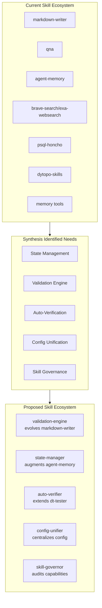

# Synthesis Learnings → Skills Mapping
## Recommended Skill Extensions & New Skills

**Based on**: 45 synthesis documents analyzed (openclaw, -pi, flexitts workspaces)  
**Date**: March 28, 2026

---

## 1. LEARNING → SKILL MAPPING MATRIX

### Map Overview: Synthesis Theme → Skill Solution

| Learning Theme | Best Existing Skill | Recommended Skill Extension | New Skill Needed |
|----------------|---------------------|----------------------------|------------------|
| **State Consolidation** | `agent-memory` | Honcho memory enhancement | **state-manager** |
| **Architecture Gaps** | `dt-architect` | Architectural documentation | **validation-engine** |
| **Validation Gaps** | `qna` | Read-only validation | **auto-verifier** |
| **Configuration Fragmentation** | `markdown-writer` | Config as code validation | **config-unifier** |
| **Skill Boundary Violations** | `dt-manager` | Skill audit capability | **skill-governor** |

---

## 2. DETAILED SKILL RECOMMENDATIONS BY LEARNING

### LEARNING 1: State Consolidation (12 Documented Cases)

#### **2.1.1 Email Automation State Store**
**Learning**: Configuration scattered across 4+ locations for email pipelines

**Recommended Skill**: **`state-manager`** (NEW)

```yaml
name: state-manager
description: Unified state management for automation pipelines
purpose: |
  Provides centralized state management for scripts, automation jobs,
  and workflows. Eliminates scattered state files with a unified API.

use_cases:
  - Email pipeline state (seen_ids by pipeline type)
  - Cron job completion flags
  - Idempotency tracking
  - Cross-pipeline state visibility
  - Atomic read/write operations with backups

tools:
  - state-manager:
      - record_seen(pipeline, id)
      - is_processed(pipeline, id)
      - update_health(pipeline, status)
      - atomic_transaction(operations)
      - backup_state()
      - list_states()

implementation:
  backend: ~/.openclaw/state/
  format: json with atomic write
  concurrency: file locking for multi-process safety

coverage:
  - Email monitoring: recruiter/grocery/comfy pipelines
  - Grocery deals: Safeway/Lucky/Ralphs/SmartFinal
  - Cron job: completion flags between stages
```

**Why This Skill**: 
- The synthesis documents specifically call out state fragmentation as the #1 issue
- Existing skills don't address state management across script boundaries
- Would consolidate 4+ separate state files into unified namespace

---

#### **2.1.2 Token Management Configuration**
**Learning**: Token thresholds tuned together but configured separately

**Extend Skill**: **`agent-memory`**

```yaml
skill_extensions:
  agent-memory:
    new_tools:
      - honcho_config:get(name):
          description: Retrieve configuration with validation
          returns: ValidatedConfig object
          
      - honcho_config:set(name, value, validation=True):
          description: Set validated configuration
          validates: "Ensures threshold relationships consistent"
          
      - honcho_config:validate():
          description: Validate current configuration state
          checks:
            - "reflector > observer"
            - "keepRecentTokens < compactionThreshold"
            - "reserveTokens < contextWindow"
            
config_schema:
  token_management:
    reflector:
      maxTokens: { type: int, min: 1000, max: 100000 }
    observer:
      maxTokens: { type: int, min: 1000, max: 100000 }
    keepRecentTokens: { type: int }
    reserveTokens: { type: int }
    compactionTrigger: { type: int, derived: "contextWindow - reserveTokens" }
    
    validation_rules:
      - reflector.maxTokens > observer.maxTokens
      - compactionTrigger > keepRecentTokens
```

**Why This Extension**:
- Token thresholds are currently scattered
- Only centralized config can enforce validation rules
- Would catch inconsistent configurations before they cause compaction errors

---

#### **2.1.3 Extension Configuration Protocol**
**Learning**: 3-step pattern (settings.json → restart → verify) never codified

**Extend Skill**: **`markdown-writer`** or **`dt-manager`**

```yaml
skill_extensions:
  dt-manager:
    new_capability: extension_installation_protocol
    
    tools:
      - extension:install(extension_name, config):
          steps:
            1. Update settings.json with validation
            2. Restart pi with timeout/retry
            3. Automatic verification of:
               - Extension loaded in service
               - Tools available
               - Logs show success
            4. Report status with rollback option
          
      - extension:verify(extension_name):
          checks:
            - Service status (api/deriver/honcho)
            - Extension in tool list
            - Log output contains success markers
            - Test invocation succeeds
            
      - extension:rollback(extension_name):
          restoring previous settings

automation:
  post_config_validation:
    enabled: true
    triggers:
      - settings.json modification
      - environment variable change
    actions:
      - Check service status
      - Verify log output
      - Report success/failure
```

**Why This Skill**: 
- Currently manual verification despite preference for automation
- Codifies the implicit 3-step pattern into reusable protocol
- Eliminates manual "check the logs" steps

---

### LEARNING 2: Architecture Gaps (7 Documented Gaps)

#### **2.2.1 Unified Validation Engine**
**Learning**: 6 diagram formats declared, only Mermaid implemented

**New Skill**: **`validation-engine`**

```yaml
name: validation-engine
description: Pluggable validation framework for multiple formats
purpose: |
  Unified validation with pluggable format handlers. Consolidates
  scattered validation scripts into reusable framework.

inherited_from: markdown-writer  # Evolves markdown-writer v2.0

format_handlers:
  registered:
    - mermaid:
        status: implemented
        source: markdown-writer/validate_markdown.py
    - plantuml:
        status: missing  # To be implemented
    - d2:
        status: missing  # To be implemented
    - graphviz:
        status: missing  # To be implemented
    - structurizr:
        status: missing  # To be implemented
    - wireviz:
        status: missing  # To be implemented

capability_separation:
  read_only_mode:
    available_to: [qna, dt-reviewer]
    actions: [validate, report_errors]
  
  write_capable_mode:
    available_to: [markdown-writer, dt-developer]
    actions: [validate, report_errors, auto_fix, suggest_fixes]

tools:
  - validation:register(format, handler_module):
  - validation:validate(content, format):
  - validation:validate_file(file_path, formats=[]):
  - validation:auto_fix(content, format):
  - validation:list_supported():
```

**Integrates With**:
- `qna` → Read-only validation (no file modification)
- `markdown-writer` → Validation + fix capability

---

#### **2.2.2 Resilient Processing Module**
**Learning**: Retry/fallback logic scattered across honcho.ts

**Recommended**: **`dt-worker`** enhancement or new **`resilient-executor`**

```yaml
skill_extensions:
  dt-worker:
    new_capability: resilient_processing
    
    utilities:
      ResilientProcessor:
        config:
          maxRetries: int
          retryDelay: int
          fallbackStrategies: List[Strategy]
          boundarySplitters: List[Splitter]  # paragraph→sentence→char
          
        methods:
          process_with_retry(item, operation):
          process_with_fallback(item, strategies):
          chunk_by_boundary(content, boundaries):
          
        applications:
          - honcho.ts: flushMessages with retry
          - message chunking with fallback
          - batch processing with partial failure handling
          - API calls with exponential backoff

integration:
  replaces_scattered_implementations:
    - "flushMessages chunk retries [id:t57dyEsTj516VBaFmM7iq]"
    - "Async Flush Pattern [id:6yMUc3Phzm0PgFUQs8fcU]"
    - "paragraph→sentence→character fallback [id:0DVTUr6jNOaTEOijD31Gq]"
```

---

#### **2.2.3 Workspace Pre-Validation**
**Learning**: Invalid workspace names ('-pi') cause 422 errors post-facto

**Extend Skill**: **`dt-tester`**

```yaml
skill_extensions:
  dt-tester:
    new_tools:
      validation:workspace_name(name):
        description: Pre-validate workspace name before API call
        checks:
          - "not starts with -"
          - "not reserved word"
          - "matches ^[a-zA-Z0-9_-]+$"
          - "length between 1-64"
        returns: ValidationResult
        error: Clear message with suggestion
        
      validation:pre_flight_check(request_type, params):
        description: Validate all request parameters before API call
        applies_to:
          - honcho requests
          - file system operations
          - external API calls
```

---

### LEARNING 3: Validation/Verification Gaps (18+ Cases)

#### **2.3.1 Automated Configuration Verification**
**Learning**: Manual verification despite explicit preference for automation

**New Skill**: **`auto-verifier`**

```yaml
name: auto-verifier
description: Automated post-configuration verification
purpose: |
  Eliminates manual verification workflows. Automatically validates
  configuration changes across services.

triggers:
  - settings.json modification
  - environment variable change
  - extension installation
  - crontab modification

verification_targets:
  honcho:
    - Service process running
    - Port 5433 responsive
    - Log contains "ready" marker
    
  api:
    - Service responsive
    - Health check endpoint
    
  deriver:
    - Process status
    - Recent log activity
    - Message processing rate
    
  extensions:
    - Extension loaded in tool list
    - Test invocation succeeds
    - No error in extension logs

tools:
  - verify:config_change(service):
  - verify:extension_install(extension_name):
  - verify:cron_environment():
  - verify:report_status():

dytopo_integration:
  used_by: dt-tester
  triggers: dt-developer post-deployment checks
```

---

#### **2.3.2 Cron Dependency Validation**
**Learning**: gogcli path errors, PATH issues in cron context

**New Skill**: **`cron-validator`** or extend **`dt-tester`**

```yaml
preferred: extend dt-tester

new_tools:
  cron:validate_environment():
    description: Pre-execution validation for cron jobs
    checks:
      - PATH contains required binaries
      - Environment variables set
      - State dependencies exist
      - Completion flags from prior stages
      - Disk space, memory available
    returns: ValidationReport
    
  cron:check_dependencies(job_name):
    description: Verify upstream job completion
    handles:
      - Staggered pipeline: email_monitor → scraping → report
      - Completion flag files
      - State file freshness
      - Error propagation

integration:
  called_by: cron_wrapper.sh
```

---

### LEARNING 4: Configuration Fragmentation (18+ Cases)

#### **2.4.1 Credential Inventory Tool**
**Learning**: Credentials scattered across 4+ locations

**Extend Skill**: **`dt-reviewer`** (security auditing)

```yaml
skill_extensions:
  dt-reviewer:
    new_tools:
      security:audit_credentials():
        description: Unified credential inventory and audit
        locations_scanned:
          - ~/.env (LLM API keys)
          - ~/.kube/config (K8s)
          - ~/.docker/config.json (Docker)
          - ~/.git-credentials (Git HTTPS)
          - ~/.openclaw/openclaw.json
          - ~/.aws/credentials
          - ~/.config/gcloud/
          - ~/.bashrc (GOG_KEYRING_PASSWORD)
          - crontab environment
          
        features:
          - Enumerate all credential locations
          - Identify duplicates
          - Check permissions (world-readable?)
          - Detect plain-text passwords
          - Report rotation status
          
      security:credential_rotate(credential_type):
        description: Single-point rotation trigger
        steps:
          1. Locate all instances
          2. Generate new credentials
          3. Update all locations
          4. Verify propagation
          5. Revoke old credentials
        
        coverage:
          - API keys (OpenAI, Anthropic)
          - Cloud credentials (AWS, GCP)
          - Container registries (Docker Hub)
          - Bot tokens (Discord, Telegram)
          - Version control (GitHub, Git HTTPS)
```

**Why This Extension**:
- Security-focused skill already exists (dt-reviewer)
- Synthesis called this out as critical after LiteLLM incident
- Currently manual checking of 4+ locations during rotation

---

#### **2.4.2 Configuration Unification**
**Learning**: 4+ independent persistence mechanisms

**New Skill**: **`config-unifier`**

```yaml
name: config-unifier
description: Unified configuration management layer
purpose: |
  Eliminates scattered configuration across .env, settings.json,
  shell config files, and ad-hoc locations.

unified_config_location: ~/.openclaw/config/

config_namespace:
  llm:
    file: llm-config.yaml
    settings: [models, defaults, api_keys]
    
  peer:
    file: peer-config.yaml
    settings: [name, default_workspace, tags]
    
  workspace:
    file: workspace-config.yaml
    settings: [paths, default_llm, persistence]
    
  notifications:
    file: notification-config.yaml
    settings: [discord, telegram, email, thresholds]
    
  security:
    file: security-config.yaml
    settings: [credential_paths, rotation_policy]

tools:
  - config:get(category, setting):
  - config:set(category, setting, value):
  - config:validate():
  - config:migrate(from_format, to_format):
  - config:backup():
  - config:restore(version):

migration_support:
  from_scattered:
    - settings.json → unified
    - ~/.env → unified  # split from all-in-one
    - .bashrc exports → unified
    - cron env → unified with cron-wrapper
```

---

### LEARNING 5: Skill Boundary Violations

#### **2.5.1 Skill-Governor (Quality Assurance)**
**Learning**: Gap between declared capability and actual implementation

**New Skill**: **`skill-governor`**

```yaml
name: skill-governor
description: Skill boundary enforcement and capability audit
purpose: |
  Tracks declared vs actual capabilities in skills.
  Detects when implementation falls behind documentation.

checks:
  - Declared formats vs implemented handlers
  - Tool availability vs documentation claims
  - Required vs optional dependencies
  - Test coverage vs functionality
  - Documentation staleness

tools:
  - skill:audit(skill_name):
      checks:
        - SKILL.md claims vs actual scripts
        - Registered tools vs implemented tools
        - Format support declared vs working
      reports: GapAnalysis
      
  - skill:validate_declaration(skill_name, claim):
      description: Check if specific claim is implemented
      
  - skill:report_coverage():
      description: System-wide capability vs implementation

dytopo_integration:
  called_by: dt-reviewer
  gates: dt-architect before approving skill PR

current_gaps_to_flag:
  markdown-writer:
    declared: [mermaid, plantuml, d2, graphviz, structurizr, wireviz]
    implemented: [mermaid]
    gap: [plantuml, d2, graphviz, structurizr, wireviz]
```

---

## 3. SKILL ARCHITECTURE EVOLUTION

### Current State vs Recommended State



---

## 4. IMPLEMENTATION ROADMAP

### Phase 1: Critical Security & Automation (Week 1)
| Skill | Action | Priority |
|-------|--------|----------|
| **config-unifier** | Create new | P0 |
| **dt-reviewer** | Extend with credential audit | P0 |
| **dt-manager** | Add extension protocol | P0 |

### Phase 2: State Consolidation (Week 2-3)
| Skill | Action | Priority |
|-------|--------|----------|
| **state-manager** | Create new | P1 |
| **agent-memory** | Add token config validation | P1 |
| **auto-verifier** | Create new | P1 |

### Phase 3: Validation Framework (Week 4-5)
| Skill | Action | Priority |
|-------|--------|----------|
| **validation-engine** | Create new (evolves markdown-writer) | P2 |
| **dt-tester** | Add pre-validation tools | P2 |
| **dt-worker** | Add resilient processor | P2 |

### Phase 4: Governance Layer (Week 6)
| Skill | Action | Priority |
|-------|--------|----------|
| **skill-governor** | Create new | P2 |
| **markdown-writer** | Deprecate in favor of validation-engine | P3 |

---

## 5. SKILL-DYTOPO INTEGRATION MAP

### How New Skills Fit DyTopo Workflow

```yaml
planning_phase:
  dt-architect:
    uses:
      - validation-engine: Validate diagram formats
      - skill-governor: Check implementation feasibility
      - config-unifier: Propose configuration schemas

development_phase:
  dt-developer:
    uses:
      - state-manager: Persist build state
      - validation-engine: Validate outputs
      - resilient-executor: Handle flaky operations
      
testing_phase:
  dt-tester:
    uses:
      - auto-verifier: Automated verification hooks
      - state-manager: Test idempotency
      
review_phase:
  dt-reviewer:
    uses:
      - validation-engine: Syntax validation
      - skill-governor: Audit declared capabilities
      - credential-audit: Security review
      
orchestration:
  dt-manager:
    uses:
      - state-manager: Track session state
      - config-unifier: Manage configuration
      - auto-verifier: Post-operation verification
```

---

## 6. RECOMMENDED SKILL PRIORITY

### Top 5 Skills to Implement/Extend

| Rank | Skill | Addresses | Impact | Effort |
|------|-------|-----------|--------|--------|
| 1 | **config-unifier** | Configuration fragmentation | HIGH | 5 days |
| 2 | **dt-reviewer** (extend) | Credential inventory | HIGH | 3 days |
| 3 | **state-manager** | State consolidation | HIGH | 7 days |
| 4 | **auto-verifier** | Verification gaps | MEDIUM | 5 days |
| 5 | **validation-engine** | Architecture gaps | MEDIUM | 10 days |

---

## 7. SKILL BOUNDARY CLARIFICATION

### Existing vs New Capability Split

| Learning | Can Fix With Existing | Needs New Skill |
|----------|----------------------|-----------------|
| State Consolidation | Partial (agent-memory) | **state-manager** for cross-script state |
| Validation Engine | No (markdown-writer too narrow) | **validation-engine** for multi-format |
| Auto-Verification | No | **auto-verifier** for post-config checks |
| Config Fragmentation | No | **config-unifier** for unified config |
| Credential Inventory | **dt-reviewer** (extend) | No - add tool |
| Skill Boundaries | **dt-manager** (extend) | **skill-governor** for audit |

---

*Mapping generated from 45 synthesis documents*
*See full report: /home/dsidlo/.openclaw/workspace/synthesis-report-2026-03-28.md*
